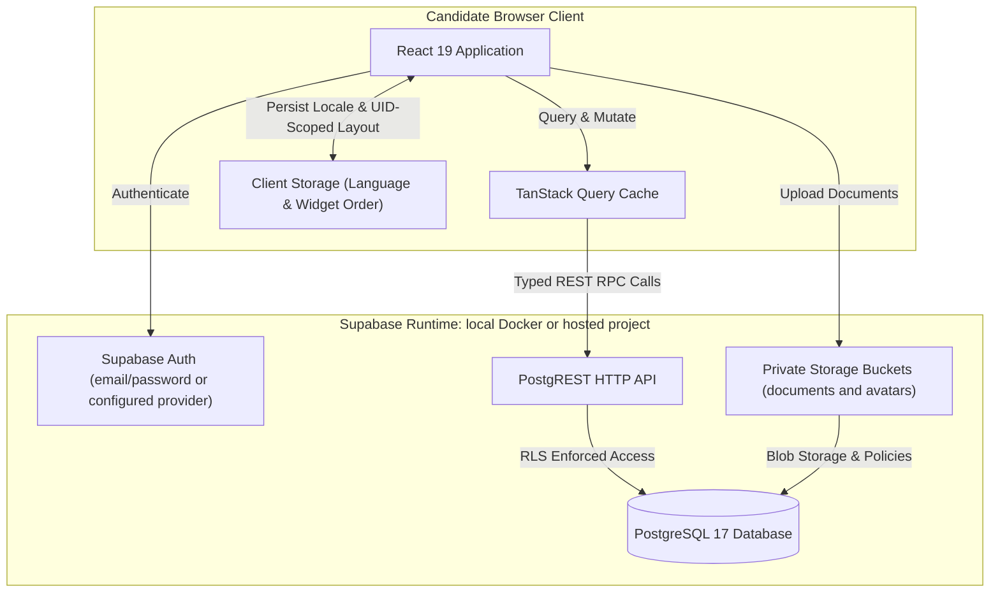
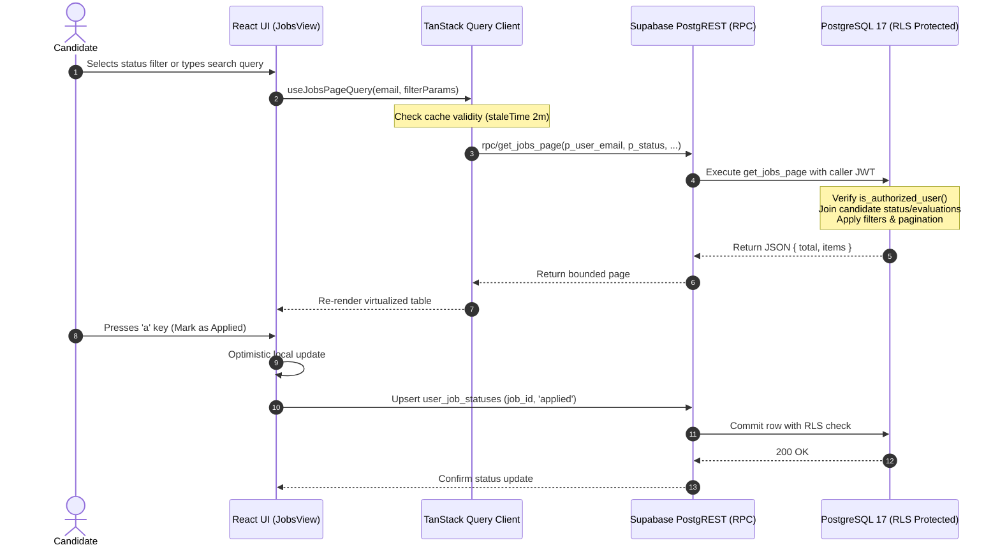

# Architecture Overview

JobPulse is a Single Page Application (SPA) paired with PostgreSQL on Supabase. This repository contains the
frontend, database migrations, and local development scripts. Job ingestion runs outside this repository.

## System Topology

## Core Architectural Principles

1. **Strict Client-Side Boundary**:
   The frontend repository only consumes data via strongly typed Supabase clients and PostgreSQL RPCs. No proprietary
   ingestion or crawling code is maintained in this repository.

2. **Tenant Isolation by Construction**:
   Personal records are protected by PostgreSQL Row-Level Security (RLS). The latest forward migration binds
   invitations to verified Auth user IDs and limits candidate row reads to that immutable ID. Legacy rows with no
   owner ID require reviewed recovery; see the security documentation.

3. **Optimistic UI with Query Refresh**:
   When a user moves an opportunity through pipeline stages (`new`, `applied`, `interviewing`, `interested`,
   `not_interested`), the UI updates optimistically and commits the mutation to Supabase. Mutations invalidate
   affected queries. Active queries also refresh when stale and the window regains focus, or when the candidate
   selects **Refresh data** in the header. The frontend does not subscribe to catalog changes.

4. **Tiered Server-Side Aggregation**:
   Rather than downloading the entire opportunity catalog into browser memory, the client delegates heavy
   sorting, filtering, and metric calculation to PostgreSQL server-side RPC functions (`get_jobs_page` and
   `get_overview_metrics`).

## Data Flow & Lifecycle

## Application Shell & Routing

JobPulse utilizes a hairline dark design system inspired by modern developer tooling. Routing is coordinated
via React Router 7:

- `/overview`: Reorderable bento grid containing key funnel metrics and distribution charts. Widget order is stored
  in browser `localStorage` under the authenticated user's ID. It survives an overview remount in that browser,
  but does not sync across browsers or devices. If storage is unavailable, the current order works in memory.
- `/opportunities`: Keyboard-first two-pane master-detail view for triaging open opportunities.
- `/datasources`: Live source telemetry and reported opportunity counts across connected boards.
- `/profile`: Comprehensive candidate profile editor, document vault (CVs & cover letters), and scoring configuration.

Shared, application-independent UI primitives and semantic visual tokens live in
`src/design-system/`; see [Design System](DESIGN_SYSTEM.md). JobPulse-specific
views compose those primitives in `src/components/`.

For local topology, credential injection, backup restore, and production parity,
see [Local Development, Backups & Restore](LOCAL_DEVELOPMENT.md).

## Internationalization (i18n) & Localization (l10n) Subsystem

JobPulse features a decoupled internationalization and localization architecture:

- **Core Engine**: Initialized via `i18next` and `react-i18next` in `src/lib/i18n.ts`.
- **Locale Persistence**: User language preferences are detected via `LanguageDetector` and stored in
  browser `localStorage` (`jobpulse_lng`).
- **Resource Bundles**: Isolated JSON dictionaries in `src/locales/en/translation.json` and
  `src/locales/pt-BR/translation.json`.
- **Locale-Aware Formatting**: Unified utility functions (`formatDate`, `formatNumber`) leverage the
  ECMAScript `Intl` API dynamically bound to the candidate's active language choice (`en` vs `pt-BR`), ensuring
  correct date formats (e.g. `10/09/2026`) and number separators (e.g. `8.478`).

## Error Tracking & Observability Subsystem

JobPulse isolates error reporting through a centralized, pluggable logger in `src/lib/logger.ts`:

- **Decoupled Call Sites**: Components (`ErrorBoundary`), Supabase mutation handlers, and authentication services
  route errors exclusively through `reportError(error, context)`.
- **Pluggable Reporter**: Production telemetry providers such as Sentry register a capture handler via
  `setErrorReporter(reporter)` without altering application call sites.
- **Global Error Interception**: `initGlobalErrorLogging()` captures unhandled promise rejections and window-level
  uncaught errors.
- **Step-by-Step Enablement**: For Sentry installation, CSP updates, user context tracking, and PII protection rules,
  see [Error Tracking & Monitoring](ERROR_TRACKING_AND_MONITORING.md).
