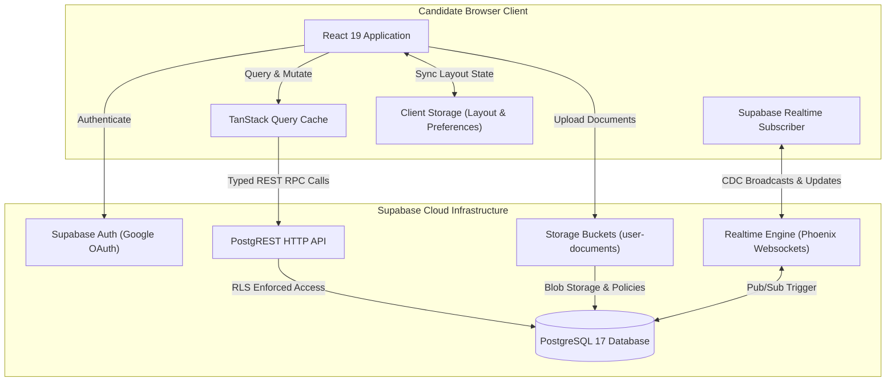

# Architecture Overview

JobPulse is built as a cloud-native, high-performance Single Page Application (SPA) paired with a PostgreSQL
database hosted on Supabase. It decouples user interactions, search indexing, and real-time candidate
telemetry from background ingestion pipelines.

## System Topology

## Core Architectural Principles

1. **Strict Client-Side Boundary**:
   The frontend repository only consumes data via strongly typed Supabase clients and PostgreSQL RPCs. No proprietary
   ingestion or crawling code is maintained in this repository.

2. **Tenant Isolation by Construction**:
   Every personal record (profile, resume, cover letter, application status, custom scoring rule) is strictly
   partitioned by the user's authenticated email using PostgreSQL Row-Level Security (RLS). Users cannot read,
   mutate, or enumerate other candidates' records.

3. **Optimistic UI with Real-Time Reconciliation**:
   When a user moves an opportunity through pipeline stages (`new`, `applied`, `interviewing`, `interested`,
   `not_interested`), the UI immediately updates locally, dispatches a peer broadcast to all other open tabs
   or devices owned by that candidate, and commits the mutation to Supabase asynchronously.

4. **Tiered Server-Side Aggregation**:
   Rather than downloading the entire opportunity catalog into browser memory, the client delegates heavy
   sorting, filtering, and metric calculation to PostgreSQL server-side RPC functions (`get_jobs_page` and
   `get_overview_metrics`).

## Data Flow & Lifecycle

## Application Shell & Routing

JobPulse utilizes a hairline dark design system inspired by modern developer tooling. Routing is coordinated
via React Router 7:

- `/overview`: Reorderable bento grid containing key funnel metrics and distribution charts.
- `/opportunities`: Keyboard-first two-pane master-detail view for triaging open opportunities.
- `/datasources`: Live source telemetry and reported opportunity counts across connected boards.
- `/profile`: Comprehensive candidate profile editor, document vault (CVs & cover letters), and scoring configuration.

## Internationalization (i18n) & Localization (l10n) Subsystem

JobPulse features a decoupled internationalization and localization architecture:

- **Core Engine**: Initialized via `i18next` and `react-i18next` in `src/lib/i18n.ts`.
- **Locale Persistence**: User language preferences are detected via `LanguageDetector` and stored in
  browser `localStorage` (`jobpulse_lng`).
- **Resource Bundles**: Isolated JSON dictionaries in `src/locales/en/translation.json` and
  `src/locales/pt-BR/translation.json`.
- **Locale-Aware Formatting**: Unified utility functions (`formatDate`, `formatNumber`) leverage the
  ECMAScript `Intl` API dynamically bound to the candidate's active language choice (`en` vs `pt-BR`), ensuring
  correct date formats (e.g. `10/09/2026`) and number separators (e.g. `8.478`).
