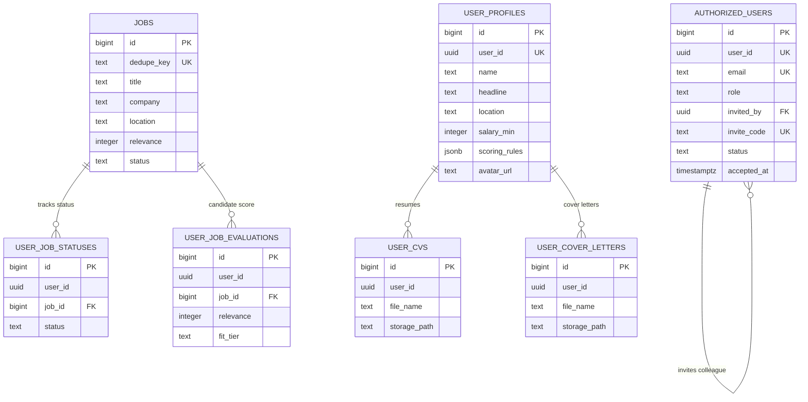

# Database Schema & Migrations

PostgreSQL tables, RLS policies, and procedures are managed via Supabase CLI in `supabase/migrations/`.

## Architecture & Relationships

## Core Tables

| Table | Description | Access & Isolation |
| :--- | :--- | :--- |
| `jobs` | Global catalog of open opportunities | Shared read for authorized users |
| `sources` | Feed sync status and crawl telemetry | Shared read for authorized users |
| `authorized_users` | Team member access list & invitations (`pending`, `accepted`, `revoked`) | Self-lookup by `user_id = auth.uid()` or invitation claim |
| `user_profiles` | Preferences, target skills, scoring rules | Candidate RLS (`user_id = auth.uid()`) |
| `user_job_statuses` | Pipeline stages (`new`, `applied`, `interviewing`, etc.) | Candidate RLS (`user_id = auth.uid()`) |
| `user_job_evaluations` | Candidate match scores, fit tier & analysis | Candidate RLS (`user_id = auth.uid()`) |
| `user_cvs` | Uploaded resume metadata | Candidate RLS (`user_id = auth.uid()`) |
| `user_cover_letters` | Uploaded cover letter metadata | Candidate RLS (`user_id = auth.uid()`) |

Candidate tables strictly enforce `user_id = auth.uid()`. Legacy `user_email` columns have been dropped across all tables and scraper services. Storage objects (`user-documents` and `avatars`) enforce ownership via matching UID paths and RLS policies.

## Invitations & Access Lifecycle

Access is strictly invite-only:
1. An authorized user creates an invitation with an email and optional role. The database generates a cryptographic `invite_code` and records `invited_by = auth.uid()`, with `status = 'pending'`.
2. When the invitee signs up and confirms their email, the `bind_verified_invitation()` trigger binds `auth.users.id` to `authorized_users.user_id`, transitions status to `accepted`, and sets `accepted_at`.
3. If an existing invitation is pending, team members can re-share the invitation link or hard-delete it to revoke access.
4. Authorization is enforced across all tables and RPCs via `public.is_authorized_user()`, requiring a confirmed Auth account and `status = 'accepted'`.

## Account Deletion

The Profile danger zone calls the authenticated `delete-account` Edge Function:
1. Verifies caller identity from the JWT; cannot delete arbitrary UUIDs.
2. Removes all files in `user-documents` and `avatars` owned by the user.
3. Hard-deletes the `auth.users` row; foreign keys cascade candidate records (`user_profiles`, `user_job_statuses`, `user_job_evaluations`, `user_cvs`, `user_cover_letters`).
4. The `purge_deleted_account_access` trigger cleans up `authorized_users` and pending invitations issued by that account. Accepted colleagues remain with `invited_by` set to `NULL`.

## Stored Procedures (RPCs)

- **`get_overview_metrics()`**: Computes funnel stage counts, average match scores, score distributions, domain categories, and top skills in a single query.
- **`get_jobs_page(...)`**: Single source of truth for the opportunities catalog. Applies server-side search, domain, salary, and score filtering with offset pagination (`{ total: number, items: Job[] }`).

Both functions use `SECURITY DEFINER` and enforce `is_authorized_user()` and `user_id = auth.uid()`.

## Migration Workflow

Follow [Local Development](LOCAL_DEVELOPMENT.md#migration-workflow). Create forward
migrations; never edit applied ones. Regenerate TypeScript and Python types
together with `make db-types`. CI checks both for drift.
