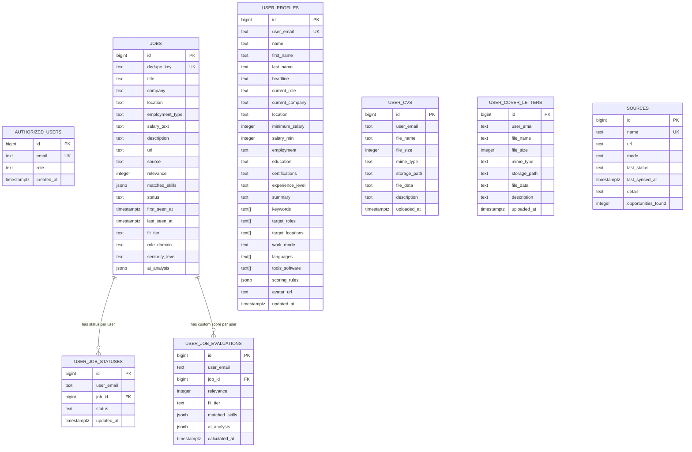

# Database Schema & Migration Management

The JobPulse database is managed via Supabase CLI and version-controlled migrations in `supabase/migrations/`.
All tables and procedures live in the `public` schema with Row-Level Security (RLS) enabled.

## Entity Relationship Diagram



## Core Tables

| Table Name | Description | Tenant Isolation |
| :--- | :--- | :--- |
| `jobs` | Global catalog of open opportunities | Shared read for authorized users |
| `sources` | Opportunity feed health and sync telemetry | Shared read for authorized users |
| `authorized_users` | Access whitelist and role mapping | Self-lookup only (`email = jwt.email`) |
| `user_profiles` | Candidate career preferences, skills, and resume data | Strictly isolated (`user_email = jwt.email`) |
| `user_job_statuses` | Candidate pipeline stages (`new`, `applied`, etc.) | Strictly isolated (`user_email = jwt.email`) |
| `user_job_evaluations` | Candidate-specific relevance scores and AI reasoning | Strictly isolated (`user_email = jwt.email`) |
| `user_cvs` | Metadata and storage pointers for uploaded resumes | Strictly isolated (`user_email = jwt.email`) |
| `user_cover_letters` | Metadata and storage pointers for cover letters | Strictly isolated (`user_email = jwt.email`) |

## Server-Side Stored Procedures (RPCs)

### 1. `get_overview_metrics(p_user_email TEXT)`

- **Purpose**: Computes funnel status counts, match score distributions, category breakdowns, and top skills
  in a single query run directly on the PostgreSQL server.
- **Security**: Defined with `SECURITY DEFINER`. Enforces `public.is_authorized_user()` and checks that the caller
  JWT email matches `p_user_email`. Unauthenticated access (`anon`) is revoked.

### 2. `get_jobs_page(...)`

- **Purpose**: High-speed paginated query for the opportunities view. Applies search, domain, compensation,
  and match filters at the database level and returns `{ total: number, items: Job[] }`.
- **Security**: Defined with `SECURITY DEFINER`. Validates that caller is authorized and cannot request data
  for other user emails.

## Migration Parity & Type Generation

When modifying schema, follow this strict lifecycle:

```bash
# 1. Create a new migration file
npm run db:migration <migration_name>

# 2. Test locally or push to remote Supabase project
npm run db:push

# 3. Regenerate TypeScript database types
npm run db:types

# 4. Verify code quality gate
npm run check
```

> [!IMPORTANT]
> The database migrations in `supabase/migrations/` must always match the generated types in
> `src/types/database.types.ts`. Never manually edit generated types without applying the corresponding migration.
