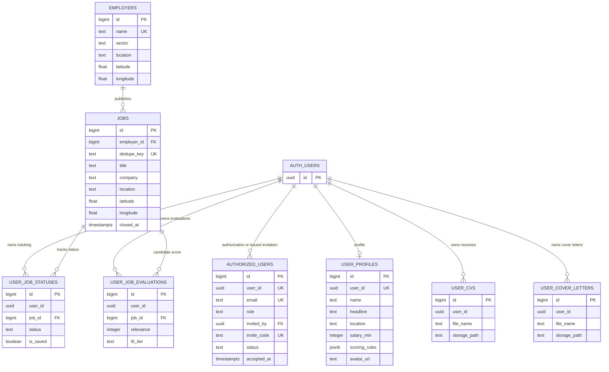

# Database Schema & Migrations

PostgreSQL tables, RLS policies, and procedures are managed via Supabase CLI in `supabase/migrations/`.

## Architecture & Relationships

```mermaid
erDiagram
    AUTH_USERS {
        uuid id PK
    }
    AUTHORIZED_USERS {
        bigint id PK
        uuid user_id UK
        text email UK
        text role
        uuid invited_by FK
        text invite_code UK
        text status
        timestamptz accepted_at
    }
    EMPLOYERS {
        bigint id PK
        text name UK
        text sector
        text location
        float latitude
        float longitude
    }
    JOBS {
        bigint id PK
        bigint employer_id FK
        text dedupe_key UK
        text title
        text company
        text location
        float latitude
        float longitude
        timestamptz closed_at
    }
    USER_PROFILES {
        bigint id PK
        uuid user_id UK
        text name
        text headline
        text location
        integer salary_min
        jsonb scoring_rules
        text avatar_url
    }
    USER_JOB_STATUSES {
        bigint id PK
        uuid user_id
        bigint job_id FK
        text status
        boolean is_saved
    }
    USER_JOB_EVALUATIONS {
        bigint id PK
        uuid user_id
        bigint job_id FK
        integer relevance
        text fit_tier
    }
    USER_CVS {
        bigint id PK
        uuid user_id
        text file_name
        text storage_path
    }
    USER_COVER_LETTERS {
        bigint id PK
        uuid user_id
        text file_name
        text storage_path
    }

    AUTH_USERS ||--o{ AUTHORIZED_USERS : "authorization or issued invitation"
    AUTH_USERS ||--o| USER_PROFILES : "profile"
    AUTH_USERS ||--o{ USER_JOB_STATUSES : "owns tracking"
    AUTH_USERS ||--o{ USER_JOB_EVALUATIONS : "owns evaluations"
    AUTH_USERS ||--o{ USER_CVS : "owns resumes"
    AUTH_USERS ||--o{ USER_COVER_LETTERS : "owns cover letters"
    EMPLOYERS ||--o{ JOBS : "publishes"
    JOBS ||--o{ USER_JOB_STATUSES : "tracks status"
    JOBS ||--o{ USER_JOB_EVALUATIONS : "candidate score"
```

## Core Tables

| Table | Description | Access & Isolation |
| :--- | :--- | :--- |
| `jobs` | Shared vacancy facts; no candidate scores or explanations | Shared read for authorized users |
| `employers` | Shared employer registry, sectors, headquarters locations, and coordinates | Shared read for authorized users |
| `employer_offices` | Shared company addresses and public evidence; not verified vacancy workplaces | Shared read for authorized users; backend writes |
| `employer_office_lookups` | Persistent office research outcomes and retry dates | Backend-only; RLS and no browser grants |
| `sources` | Feed sync status and crawl telemetry | Shared read for authorized users |
| `crawl_tasks` | Durable source/detail/vector tasks, fenced leases, bounded attempts and retry dates | Backend-only; RLS and no browser grants |
| `crawl_runs` | Structured public operational outcomes for each lease attempt | Backend-only; RLS and no browser grants |
| `crawl_snapshots` | Bounded public response metadata and replay checksums; bodies remain in local storage | Backend-only; RLS and no browser grants |
| `job_occurrences` | Provider posting identity, public origin, content hash and first/last observation | Backend-only; RLS and no browser grants |
| `boards` | Scraper crawl-target catalog: provider/board/region to company, with crawl health | Backend-only; RLS and no browser grants |
| `catalog_stats` | Shared overview facet rollup refreshed by the scraper; `is_valid` is cleared transactionally by job/employer writes | Backend-only; RLS and no browser grants |
| `authorized_users` | Access and invitations (`pending`, `accepted`); revocation deletes the invitation | Own authorization row and issuer-owned invitations |
| `user_profiles` | Preferences, target skills, scoring rules | Candidate RLS (`user_id = auth.uid()`) |
| `user_job_statuses` | Stages (`new`, `applied`, `interviewing`, `rejected`, `not_interested`) and independent `is_saved` bookmark | Candidate RLS (`user_id = auth.uid()`) |
| `user_job_evaluations` | Candidate match scores, fit tier & analysis | Candidate RLS (`user_id = auth.uid()`) |
| `job_scoring_embeddings` | Versioned shared job vectors | Service role only; RLS enabled |
| `profile_scoring_embeddings` | Versioned private candidate vectors | Private table; own-vector write RPC; RLS enabled |
| `candidate_scoring_work` | Durable candidate matching progress, retry state and bounded shortlist work | Backend-only; RLS and no browser grants |
| `scoring_catalog_generation` | Statement-level shared vector catalog revision | Backend-only; RLS and no browser grants |
| `user_cvs` | Uploaded resume metadata | Candidate RLS (`user_id = auth.uid()`) |
| `user_cover_letters` | Uploaded cover letter metadata | Candidate RLS (`user_id = auth.uid()`) |

Candidate tables strictly enforce `user_id = auth.uid()`. Storage objects (`user-documents` and `avatars`) enforce ownership via matching UID paths and RLS policies.

## Canonical Candidate Scoring

`user_job_evaluations`, keyed by `(user_id, job_id)`, is the sole source of
relevance, fit tier, matched skills, and explanations. Profile-dependent sector
and seniority classifications live in its `ai_analysis` JSON. The shared `jobs`
table contains only vacancy facts and lifecycle metadata. Candidate tracking lives
only in `user_job_statuses`; a missing candidate status is `new`. There is no
shared job status or `is_admin()` authorization alias.

`get_jobs_page`, `get_overview_metrics`, and browser detail/preview queries read
only the current user's evaluation. An absent evaluation returns relevance `0`,
fit tier `Unassessed`, empty matched skills, and no explanation. It never falls
back to another candidate's score. Unassessed private role classification defaults to `Uncategorized`; the shared
catalog sector remains independently available from trusted employer metadata.

Profile matching uses `salary_min` for the annual EUR target. There is no
`minimum_salary` alias in application code. Job salary amounts, currency, and
period are normalized by `normalize_job_salary` when raw salary text changes.
Decimal `k` amounts and ranges such as `55.5–70k` are supported. Scoring rules
use `keywords` and `disqualifiers`; explicitly empty lists remain empty.

## Invitations & Access Lifecycle

Access is strictly invite-only:
1. An authorized user creates an invitation with an email. The database generates a cryptographic `invite_code` and records `invited_by = auth.uid()`, with `status = 'pending'`.
2. When the invitee signs up and confirms their email, the `bind_verified_invitation()` trigger binds `auth.users.id` to `authorized_users.user_id`, transitions status to `accepted`, and sets `accepted_at`.
3. Only the issuer can recover/re-share a pending invitation code or hard-delete their invitation. Another authorized member cannot read its code or delete it.
4. Authorization is enforced across all tables and RPCs via `public.is_authorized_user()`, requiring a confirmed Auth account and `status = 'accepted'`.

## Account Deletion

The Data and privacy danger zone calls the authenticated `delete-account` Edge Function:
1. Verifies caller identity from the JWT; cannot delete arbitrary UUIDs.
2. Removes all files in `user-documents` and `avatars` owned by the user.
3. Hard-deletes the `auth.users` row; foreign keys cascade candidate records (`user_profiles`, `user_job_statuses`, `user_job_evaluations`, `user_cvs`, `user_cover_letters`).
4. The `purge_deleted_account_access` trigger cleans up `authorized_users` and pending invitations issued by that account. Accepted colleagues remain with `invited_by` set to `NULL`.

## Stored Procedures (RPCs)

- **`get_overview_metrics()`**: Counts all registered employers, including employers without vacancies.
  Vacancy totals, facets and caller-specific metrics exclude closed jobs. Valid shared
  facets come from `catalog_stats`; invalid facets fall back to the live catalog.
  Match averages and distributions use assessed jobs only. New includes untracked
  and explicitly New jobs, including saved New jobs.
- **`get_jobs_page(...)`**: Single source of truth for the opportunities catalog. Applies server-side search, sector,
  salary, and score filtering with offset pagination (`{ total: number, items: Job[] }`). Count and page share one
  SQL statement so the filtered CTE stays in scope and out-of-range pages retain the correct total.
  `supabase/tests/jobs_pagination.sql` verifies pagination, empty pages, literal locations, and browser filter/sort options.
  Salary thresholds accept `10k` through `300k` in `10k` increments and compare annual EUR amounts.
  `all` and `disclosed` remain compatible; list/map parity and caller isolation are covered by
  `supabase/tests/tenant_salary_range.sql`.
- **`rescore_user(uid, top_k)`**: Enqueues caller-owned durable scoring work and returns immediately. The private worker ranks an exact shortlist of up to 1,500 jobs and scores at most 100 changed jobs per call.
- **`save_profile_embedding_guarded(...)` / `get_profile_embedding_state()`**: Submit
  the caller's validated, nonzero 384-dimensional vector only if its profile snapshot
  still matches, and read its hash, model version and durable scoring progress.
  Neither RPC returns a vector.
- **`merge_duplicate_catalog_jobs(...)`**: Service-only deduplication; tenant statuses and evaluations are transferred inside PostgreSQL.
- **`prune_stale_catalog_jobs(...)`**: Service-only compatibility RPC returning zero. The scraper has no pruning CLI or wrapper.
- **`close_stale_jobs(...)`**: Bounded service-only compatibility no-op. Source/board
  timestamps do not establish vacancy closure. Explicitly closed jobs retain candidate history.
- **`record_board_outcome(...)`**: Service-only board
  health, failure backoff and verified-empty cooldowns.
- **`refresh_catalog_stats()`**: Service-only facet refresh, serialized with job/employer
  invalidation before marking `catalog_stats.is_valid` true.

The catalog and overview functions use `SECURITY DEFINER` and enforce
`is_authorized_user()` and `user_id = auth.uid()`. The profile and scoring RPCs
check the authenticated caller UUID; maintenance RPCs require the service role.
Vectors stay out of shared `jobs` rows and browser responses. Foreign
keys remove vectors when the associated job or profile is deleted.

## Migration Workflow

A single baseline migration under `supabase/migrations/` creates the complete schema
for a fresh database, and subsequent changes are forward migrations on top of it.
The baseline restates explicit role privileges plus the bootstrap rows, Storage
bucket rows and `pg_cron` schedules that a schema-only dump omits; keep them when
regenerating it. Applied versions remain immutable.
Follow [Local Development](LOCAL_DEVELOPMENT.md#migration-workflow)
and regenerate both language types with `make db-types`. CI checks parity.

## Durable native scoring

`profile_scoring_embeddings` remains private. Authenticated users submit only their own
384-dimensional MiniLM vector through `save_profile_embedding_guarded`; the unguarded
`save_profile_embedding` writer is restricted to the service role. Its hash and model
version are exposed through `get_profile_embedding_state` without exposing the vector.
`rescore_user` enqueues durable work in backend-only `candidate_scoring_work`. Profile and embedding writes enqueue atomically; missing embeddings and changed matching text retain an `awaiting_embedding` setup state until a new vector is saved. Assessed evaluations remain available while local inference is unfinished. Fingerprints exclude personal fields and composition weights. The worker computes an exact, stable top-1,500 shortlist, reuses unchanged evaluation factors, scores slices of at most 100 and trims native evaluations only after completion. Failures roll back that tenant's slice and retain a retry with exponential backoff and a generic SQLSTATE.

`scoring_catalog_generation` advances once per job-vector statement. Ingestion never loops over candidates. A five-second Cron worker drains persisted requests; catalog changes refresh completed candidates asynchronously. Both work tables have RLS enabled and no browser grants. Queue work and profile vectors are removed when their account is deleted.

`get_jobs_page` and `get_overview_metrics` recompose scores from persisted
`ai_analysis.sub_scores` using current profile weights.
Existing evaluations for jobs without vectors remain until those jobs receive a
vector; this avoids losing match data during a staged migration.

### Catalog sectors and verified job locations

The product exposes one shared catalog **sector**, derived from trusted employer
metadata (`metadata_source` is curated, watchlist or verified). The physical
`employers.sector` column remains for compatibility. Unknown employers contribute
`Uncategorized`. Candidate role classifications stay private matching inputs and do
not replace the catalog sector or mutate shared employer facts.

`get_overview_metrics.categories` and `sectors`, and `get_jobs_page.p_sector`, use
this same shared classification. Sector is the browser RPC classification contract.
Overview match statistics still use assessed jobs only.

Browsing groups normalize synonymous enriched labels without changing `employers.sector`.
The internal, browser-inaccessible `jobpulse_sector_group` and `jobpulse_catalog_sectors`
functions retain the 20 largest named groups by full-catalog job count (stable name
tie break); remaining groups become `Other`. `Uncategorized` stays separate.
Overview, list pagination and maps use the same mapping before applying candidate
filters, so `Other` has consistent counts and membership across views and pages.
Existing links with exact trusted employer labels remain supported.

`jobs.location_verification` records the original posting location, provider,
verification timestamp, status, confidence and precision. The service-only
`apply_job_location_verifications` RPC guards both ID and unchanged location text.
Changing that text invalidates stored verification and geocoded coordinates. Employer
headquarters never replace a vacancy location.

The authorized browser RPC `get_job_map` applies the catalog filters and each
caller's own scores/statuses, then returns bounded viewport clusters with full
filtered and verified-location counts. Pins require Geoapify verification matching
the current posting text; city, region and country centroids retain their precision.
Remote, ambiguous and unresolved jobs remain in catalog totals without a pin.
See [the operational map guide](OPERATIONS.md#vacancy-location-verification).

## Saved jobs

`user_job_statuses.is_saved` is an owner-only bookmark separate from pipeline status.
The heart calls `set_job_saved(job_id, saved)`; the RPC derives ownership from verified
`auth.uid()` and preserves Applied/Interview progress. Account exports include the
flag through the existing owner-table export; account deletion cascades remove it.
No new personal field or external telemetry is collected. Bookmark retention matches
candidate tracking retention and the existing account deletion policy.

The supported Interested input maps to `status=new, is_saved=true`.
The application uses Saved filters/counts; RPCs also expose supported Interested count aliases. Saved can overlap pipeline stages, so the
active-pipeline metric counts Applied and Interview only. Catalog merge logic ORs
bookmark flags while retaining existing progress conflict checks.

### Employer office research

`employer_offices` is an authorized-read shared directory of multiple company addresses,
coordinates, website domains and provider category evidence. It contains no candidate
data or verified vacancy-workplace claim. `employer_office_lookups` is backend-only
persistent scheduling state. Both tables have RLS; the two research RPCs are service-only.
The optional map office layer reuses the tenant-filtered catalog and labels workplace
uncertainty. See [employer office enrichment](OPERATIONS.md#employer-research-and-offices).

## Integrity enforcement

The [required verification contract](../AGENTS.md#required-verification) owns schema-change gates.
[The database runner](../scripts/test-database.mjs) checks the local migration ledger and executes SQL suites
against the local stack; it does not migrate or reset developer data. The
[tenant contract](../supabase/tests/helpers/tenant_contract.sql) classifies tables and browser RPCs and
supports negative authorization tests. The [CI gate inventory](STANDARDS_AND_CONVENTIONS.md#ci-gates)
identifies the disposable schema rebuild, migration lint and generated TypeScript/Python parity checks.
These checks enforce their tested contracts; they do not verify hosted schema, backups or recovery readiness.

`make db-types` generates both languages into ignored temporary files, validates
the output and atomically replaces each complete model. Failed generation retains
the existing files; readers never see an empty redirected output.
Python model declarations use deterministic name order so database discovery order
does not affect parity. Field or type changes remain visible to the CI drift check.

## Durable scraper writes

`enqueue_crawls_if_idle` serializes automatic starters and atomically seeds bounded
source batches using per-source eligibility. Pending/running tasks retain their
progress; their future retry dates never block eligible peers. Successful fenced
completion records `crawl_tasks.last_succeeded_at` and enforces a six-hour minimum
refresh interval. Failed source crawls wait at least six hours, preserving longer
remote delays; detail/vector retries retain independent backoff. Exhausted tasks
do not restart automatically. Explicit enqueueing retains its separate refresh
semantics without resetting pending attempts or retry dates.
Service-only crawl RPCs claim work with `FOR UPDATE SKIP LOCKED`
and use indexed recent claims to prefer alternating source/detail/vector work.
Expired leases recover first; native provider sources share turns with generic
discovery. Concurrent claims remain nonblocking and can share a scheduling turn.
The executable fairness contract lives in `tenant_crawl_fairness.sql`.
They renew live leases and reject stale writes or completion. `persist_crawl_jobs` atomically stores catalog
facts, source occurrences and detail/vector follow-up tasks. `store_crawl_vectors`
accepts inference output only while its lease and expected job facts remain current.
Candidate matching remains in `candidate_scoring_work` and its existing SQL worker.

Snapshot metadata has a sixteen-MiB response ceiling. History maintenance removes
expired or excess snapshots/runs while source occurrences retain their job identity.
Deduplication transfers provenance and candidate tracking together. Scheduling does
not overwrite a running or pending target or erase its retry budget. Executable
contracts live in `tenant_crawl_runtime.sql`, `tenant_crawl_enrichment.sql` and
`scripts/test-crawl-concurrency.mjs`; see [Required Verification](../AGENTS.md#required-verification).
