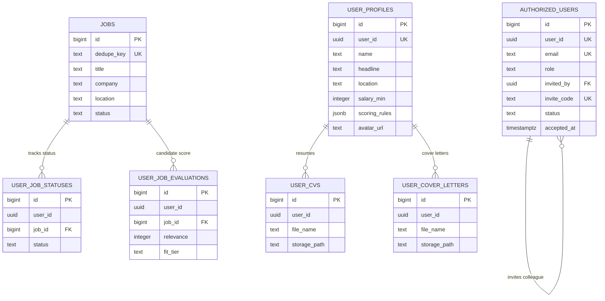

# Database Schema & Migrations

PostgreSQL tables, RLS policies, and procedures are managed via Supabase CLI in `supabase/migrations/`.

## Architecture & Relationships

```mermaid
erDiagram
    AUTHORIZED_USERS {
        bigint id PK
        uuid user_id UK
        text email UK
        text role
        uuid invited_by FK
        text invite_code UK
        text status
        timestamptz accepted_at
    }
    JOBS {
        bigint id PK
        text dedupe_key UK
        text title
        text company
        text location
        text status
    }
    USER_PROFILES {
        bigint id PK
        uuid user_id UK
        text name
        text headline
        text location
        integer salary_min
        jsonb scoring_rules
        text avatar_url
    }
    USER_JOB_STATUSES {
        bigint id PK
        uuid user_id
        bigint job_id FK
        text status
    }
    USER_JOB_EVALUATIONS {
        bigint id PK
        uuid user_id
        bigint job_id FK
        integer relevance
        text fit_tier
    }
    USER_CVS {
        bigint id PK
        uuid user_id
        text file_name
        text storage_path
    }
    USER_COVER_LETTERS {
        bigint id PK
        uuid user_id
        text file_name
        text storage_path
    }

    AUTHORIZED_USERS ||--o{ AUTHORIZED_USERS : "invites colleague"
    JOBS ||--o{ USER_JOB_STATUSES : "tracks status"
    JOBS ||--o{ USER_JOB_EVALUATIONS : "candidate score"
    USER_PROFILES ||--o{ USER_CVS : "resumes"
    USER_PROFILES ||--o{ USER_COVER_LETTERS : "cover letters"
```

## Core Tables

| Table | Description | Access & Isolation |
| :--- | :--- | :--- |
| `jobs` | Shared vacancy facts; no candidate scores or explanations | Shared read for authorized users |
| `sources` | Feed sync status and crawl telemetry | Shared read for authorized users |
| `authorized_users` | Team member access list & invitations (`pending`, `accepted`, `revoked`) | Self-lookup by `user_id = auth.uid()` or invitation claim |
| `user_profiles` | Preferences, target skills, scoring rules | Candidate RLS (`user_id = auth.uid()`) |
| `user_job_statuses` | Pipeline stages (`new`, `applied`, `interviewing`, etc.) | Candidate RLS (`user_id = auth.uid()`) |
| `user_job_evaluations` | Candidate match scores, fit tier & analysis | Candidate RLS (`user_id = auth.uid()`) |
| `job_scoring_embeddings` | Versioned shared job vectors | Service role only; RLS enabled |
| `profile_scoring_embeddings` | Versioned private candidate vectors | Service role only; RLS enabled |
| `user_cvs` | Uploaded resume metadata | Candidate RLS (`user_id = auth.uid()`) |
| `user_cover_letters` | Uploaded cover letter metadata | Candidate RLS (`user_id = auth.uid()`) |

Candidate tables strictly enforce `user_id = auth.uid()`. Legacy `user_email` columns have been dropped across all tables and scraper services. Storage objects (`user-documents` and `avatars`) enforce ownership via matching UID paths and RLS policies.

## Canonical Candidate Scoring

`user_job_evaluations`, keyed by `(user_id, job_id)`, is the sole source of
relevance, fit tier, matched skills, and explanations. Profile-dependent domain
and seniority classifications live in its `ai_analysis` JSON. The shared `jobs`
table contains only vacancy facts and lifecycle metadata.

`get_jobs_page`, `get_overview_metrics`, and browser detail/preview queries read
only the current user's evaluation. An absent evaluation returns relevance `0`,
fit tier `Unassessed`, empty matched skills, and no explanation. It never falls
back to another candidate's score. Domain defaults to `General Administration`.

The consolidation migration removes the six legacy candidate fields from
`jobs` after replacing dependent RPCs. Existing candidate evaluations and vectors
are preserved; no rescore or re-embedding is required for this cleanup. Apply the
migration before starting the cleaned-up scraper, and deploy the frontend with
it because older detail/preview queries selected the removed columns.

Profile matching uses `salary_min` for the annual EUR target. There is no
`minimum_salary` alias in application code. Job salary amounts, currency, and
period are normalized by `normalize_job_salary`; raw salary changes refresh
derived facts. A forward backfill rebuilds historical derived amounts from advertised
text and clears amounts with no source text. Decimal `k` amounts and ranges such as `55.5–70k` are supported.

The profile-rule migration canonicalizes historical JSON before the new code
reads it. `patterns` terms become `keywords`; `irish_language_patterns` becomes
`disqualifiers` only when there is no explicit canonical list. Notes, reasons,
weights, and seniority multipliers are preserved. After this rollout, run
`make scrape-rescore` to refresh evaluations using scoring version v2.

## Invitations & Access Lifecycle

Access is strictly invite-only:
1. An authorized user creates an invitation with an email and optional role. The database generates a cryptographic `invite_code` and records `invited_by = auth.uid()`, with `status = 'pending'`.
2. When the invitee signs up and confirms their email, the `bind_verified_invitation()` trigger binds `auth.users.id` to `authorized_users.user_id`, transitions status to `accepted`, and sets `accepted_at`.
3. If an existing invitation is pending, team members can re-share the invitation link or hard-delete it to revoke access.
4. Authorization is enforced across all tables and RPCs via `public.is_authorized_user()`, requiring a confirmed Auth account and `status = 'accepted'`.

## Account Deletion

The Profile danger zone calls the authenticated `delete-account` Edge Function:
1. Verifies caller identity from the JWT; cannot delete arbitrary UUIDs.
2. Removes all files in `user-documents` and `avatars` owned by the user.
3. Hard-deletes the `auth.users` row; foreign keys cascade candidate records (`user_profiles`, `user_job_statuses`, `user_job_evaluations`, `user_cvs`, `user_cover_letters`).
4. The `purge_deleted_account_access` trigger cleans up `authorized_users` and pending invitations issued by that account. Accepted colleagues remain with `invited_by` set to `NULL`.

## Stored Procedures (RPCs)

- **`get_overview_metrics()`**: Computes funnel stage counts, average match scores, score distributions, domain categories, and top skills in a single query.
- **`get_jobs_page(...)`**: Single source of truth for the opportunities catalog. Applies server-side search, domain, salary, and score filtering with offset pagination (`{ total: number, items: Job[] }`).
- **`get_job_scoring_work(...)`**: Service-only, security-invoker RPC returning exact cosine similarities for stale user-job pairs. Input is bounded to 100 jobs and 100 profiles. Returns JSON to avoid PostgREST row-limit truncation. Evaluation hashes and scoring versions enable incremental refreshes.

The catalog and overview functions use `SECURITY DEFINER` and enforce
`is_authorized_user()` and `user_id = auth.uid()`. The scoring RPC uses
`SECURITY INVOKER`; execution is revoked from public, anonymous, and authenticated
roles. Vectors are kept out of the shared `jobs` row and browser payloads. Foreign
keys remove vectors when the associated job or profile is deleted.

## Migration Workflow

Follow [Local Development](LOCAL_DEVELOPMENT.md#migration-workflow). Create forward
migrations; never edit applied ones. Regenerate TypeScript and Python types
together with `make db-types`. CI checks both for drift.
