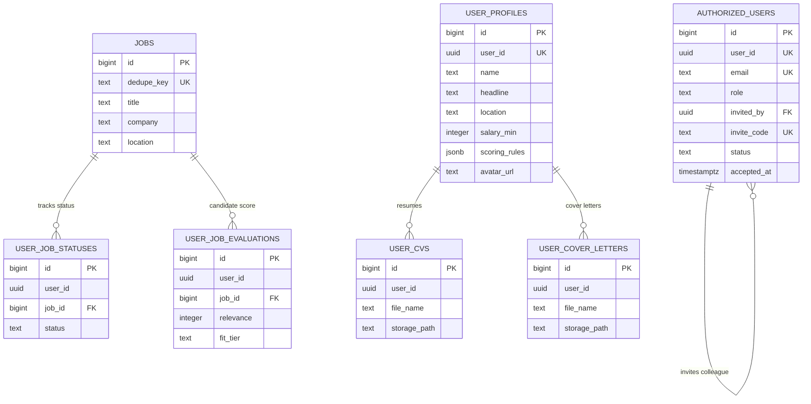

# Database Schema & Migrations

PostgreSQL tables, RLS policies, and procedures are managed via Supabase CLI in `supabase/migrations/`.

## Architecture & Relationships

```mermaid
erDiagram
    AUTHORIZED_USERS {
        bigint id PK
        uuid user_id UK
        text email UK
        text role
        uuid invited_by FK
        text invite_code UK
        text status
        timestamptz accepted_at
    }
    JOBS {
        bigint id PK
        text dedupe_key UK
        text title
        text company
        text location
    }
    USER_PROFILES {
        bigint id PK
        uuid user_id UK
        text name
        text headline
        text location
        integer salary_min
        jsonb scoring_rules
        text avatar_url
    }
    USER_JOB_STATUSES {
        bigint id PK
        uuid user_id
        bigint job_id FK
        text status
    }
    USER_JOB_EVALUATIONS {
        bigint id PK
        uuid user_id
        bigint job_id FK
        integer relevance
        text fit_tier
    }
    USER_CVS {
        bigint id PK
        uuid user_id
        text file_name
        text storage_path
    }
    USER_COVER_LETTERS {
        bigint id PK
        uuid user_id
        text file_name
        text storage_path
    }

    AUTHORIZED_USERS ||--o{ AUTHORIZED_USERS : "invites colleague"
    JOBS ||--o{ USER_JOB_STATUSES : "tracks status"
    JOBS ||--o{ USER_JOB_EVALUATIONS : "candidate score"
    USER_PROFILES ||--o{ USER_CVS : "resumes"
    USER_PROFILES ||--o{ USER_COVER_LETTERS : "cover letters"
```

## Core Tables

| Table | Description | Access & Isolation |
| :--- | :--- | :--- |
| `jobs` | Shared vacancy facts; no candidate scores or explanations | Shared read for authorized users |
| `sources` | Feed sync status and crawl telemetry | Shared read for authorized users |
| `authorized_users` | Team member access list & invitations (`pending`, `accepted`, `revoked`) | Self-lookup by `user_id = auth.uid()` or invitation claim |
| `user_profiles` | Preferences, target skills, scoring rules | Candidate RLS (`user_id = auth.uid()`) |
| `user_job_statuses` | Pipeline stages (`new`, `applied`, `interviewing`, etc.) | Candidate RLS (`user_id = auth.uid()`) |
| `user_job_evaluations` | Candidate match scores, fit tier & analysis | Candidate RLS (`user_id = auth.uid()`) |
| `job_scoring_embeddings` | Versioned shared job vectors | Service role only; RLS enabled |
| `profile_scoring_embeddings` | Versioned private candidate vectors | Private table; own-vector write RPC; RLS enabled |
| `user_cvs` | Uploaded resume metadata | Candidate RLS (`user_id = auth.uid()`) |
| `user_cover_letters` | Uploaded cover letter metadata | Candidate RLS (`user_id = auth.uid()`) |

Candidate tables strictly enforce `user_id = auth.uid()`. Legacy `user_email` columns have been dropped across all tables and scraper services. Storage objects (`user-documents` and `avatars`) enforce ownership via matching UID paths and RLS policies.

## Canonical Candidate Scoring

`user_job_evaluations`, keyed by `(user_id, job_id)`, is the sole source of
relevance, fit tier, matched skills, and explanations. Profile-dependent domain
and seniority classifications live in its `ai_analysis` JSON. The shared `jobs`
table contains only vacancy facts and lifecycle metadata. Candidate tracking lives
only in `user_job_statuses`; a missing candidate status is `new`. There is no
shared job status or `is_admin()` authorization alias.

`get_jobs_page`, `get_overview_metrics`, and browser detail/preview queries read
only the current user's evaluation. An absent evaluation returns relevance `0`,
fit tier `Unassessed`, empty matched skills, and no explanation. It never falls
back to another candidate's score. Unassessed domain defaults to `Uncategorized`.

Profile matching uses `salary_min` for the annual EUR target. There is no
`minimum_salary` alias in application code. Job salary amounts, currency, and
period are normalized by `normalize_job_salary` when raw salary text changes.
Decimal `k` amounts and ranges such as `55.5–70k` are supported. Scoring rules
use `keywords` and `disqualifiers`; explicitly empty lists remain empty.

## Invitations & Access Lifecycle

Access is strictly invite-only:
1. An authorized user creates an invitation with an email. The database generates a cryptographic `invite_code` and records `invited_by = auth.uid()`, with `status = 'pending'`.
2. When the invitee signs up and confirms their email, the `bind_verified_invitation()` trigger binds `auth.users.id` to `authorized_users.user_id`, transitions status to `accepted`, and sets `accepted_at`.
3. If an existing invitation is pending, team members can re-share the invitation link or hard-delete it to revoke access.
4. Authorization is enforced across all tables and RPCs via `public.is_authorized_user()`, requiring a confirmed Auth account and `status = 'accepted'`.

## Account Deletion

The Profile danger zone calls the authenticated `delete-account` Edge Function:
1. Verifies caller identity from the JWT; cannot delete arbitrary UUIDs.
2. Removes all files in `user-documents` and `avatars` owned by the user.
3. Hard-deletes the `auth.users` row; foreign keys cascade candidate records (`user_profiles`, `user_job_statuses`, `user_job_evaluations`, `user_cvs`, `user_cover_letters`).
4. The `purge_deleted_account_access` trigger cleans up `authorized_users` and pending invitations issued by that account. Accepted colleagues remain with `invited_by` set to `NULL`.

## Stored Procedures (RPCs)

- **`get_overview_metrics()`**: Computes funnel stage counts, average match scores, score distributions, domain categories, and top skills in a single query.
- **`get_jobs_page(...)`**: Single source of truth for the opportunities catalog. Applies server-side search, domain,
  salary, and score filtering with offset pagination (`{ total: number, items: Job[] }`). Count and page share one
  SQL statement so the filtered CTE stays in scope and out-of-range pages retain the correct total.
  `supabase/tests/jobs_pagination.sql` verifies pagination, empty pages, literal locations, and browser filter/sort options.
- **`rescore_user(uid, top_k)`**: Enqueues caller-owned durable scoring work and returns immediately. The private worker ranks an exact shortlist of up to 1,500 jobs and scores at most 100 changed jobs per call.
- **`save_profile_embedding(...)` / `get_profile_embedding_state()`**: Submit the caller's validated, nonzero 384-dimensional vector and read its hash, model version and durable scoring progress. Neither RPC returns a vector.
- **`prune_stale_catalog_jobs(...)` / `merge_duplicate_catalog_jobs(...)`**: Service-only catalog maintenance; tenant status and evaluation handling remains inside PostgreSQL.

The catalog and overview functions use `SECURITY DEFINER` and enforce
`is_authorized_user()` and `user_id = auth.uid()`. The profile and scoring RPCs
check the authenticated caller UUID; maintenance RPCs require the service role.
Vectors stay out of shared `jobs` rows and browser responses. Foreign
keys remove vectors when the associated job or profile is deleted.

## Migration Workflow

The single initial migration builds a new database at the current schema. The
linked production project's migration history is aligned to that baseline;
subsequent changes use forward migrations. Follow [Local Development](LOCAL_DEVELOPMENT.md#migration-workflow)
and regenerate both language types with `make db-types`. CI checks parity.

## Native scoring (2026-09-29)

`profile_scoring_embeddings` remains private. Authenticated users submit only their own
384-dimensional MiniLM vector through `save_profile_embedding`; its hash and model
version are exposed through `get_profile_embedding_state` without exposing the vector.
`rescore_user` enqueues durable work in backend-only `candidate_scoring_work`. Profile and embedding writes enqueue atomically; missing embeddings and changed matching text retain an `awaiting_embedding` setup state until a new vector is saved. Old evaluations remain available while local inference is unfinished. Fingerprints exclude personal fields and composition weights. The worker computes an exact, stable top-1,500 shortlist, reuses unchanged evaluation factors, scores slices of at most 100 and trims native evaluations only after completion. Failures roll back that tenant's slice and retain a retry with exponential backoff and a generic SQLSTATE.

`scoring_catalog_generation` advances once per job-vector statement. Ingestion never loops over candidates. A one-second Cron worker drains persisted requests; catalog changes refresh completed candidates asynchronously. Both work tables have RLS enabled and no browser grants. Queue work and profile vectors are removed when their account is deleted.

`get_jobs_page` and `get_overview_metrics` recompose scores from persisted
`ai_analysis.sub_scores` using current profile weights.
Existing evaluations for jobs without vectors remain until those jobs receive a
vector; this avoids losing match data during a staged migration.
