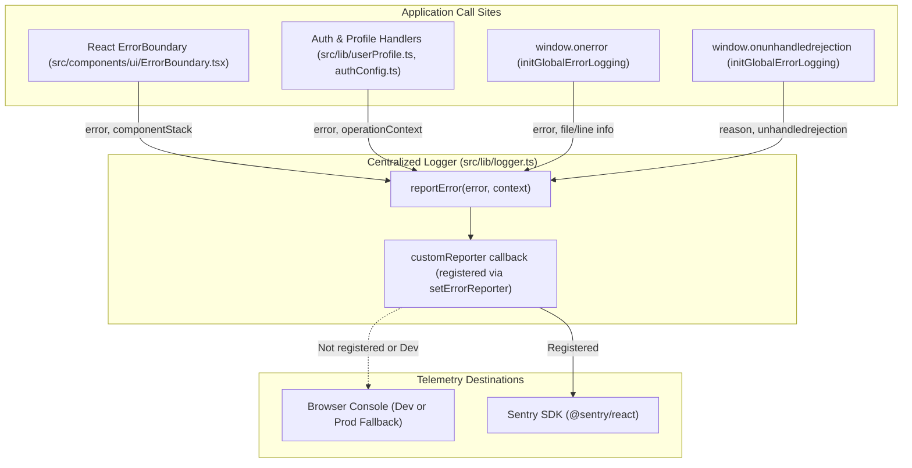

# Error Tracking & Monitoring

JobPulse implements a decoupled error reporting architecture that isolates application code from
third-party error reporting SDKs. In development, errors are logged to the browser console. In production,
external monitoring services (such as [Sentry](https://sentry.io)) can be enabled without modifying call sites.

This document details the logging architecture, step-by-step instructions for enabling Sentry, Content Security
Policy (CSP) requirements, user context attachment, and privacy/PII safeguards.

---

## 1. Error Reporting Architecture

Error handling in JobPulse is centralized in [`src/lib/logger.ts`](../src/lib/logger.ts):



### Key Components

- **`reportError(error, context)`**: Standard entry point for reporting errors across the app. Accepts any error
  instance and an optional key-value dictionary of contextual metadata.
- **`setErrorReporter(reporter)`**: Pluggable hook that registers an external reporter callback
  `(error: unknown, context?: Record<string, unknown>) => void`.
- **`initGlobalErrorLogging()`**: Attaches window-level event listeners for uncaught runtime exceptions
  (`window.onerror`) and unhandled promise rejections (`window.onunhandledrejection`).
- **`ErrorBoundary`** ([`src/components/ui/ErrorBoundary.tsx`](../src/components/ui/ErrorBoundary.tsx)): Catches
  React component render tree exceptions and forwards them to `reportError` with component stack traces.

---

## 2. Enabling Sentry Step-by-Step

### Step 1: Install Dependencies

Install the Sentry React SDK:

```bash
npm install @sentry/react
```

If you plan to upload sourcemaps automatically in production CI/CD builds, also install the Vite plugin:

```bash
npm install -D @sentry/vite-plugin
```

### Step 2: Sentry DSN Configuration

JobPulse has the Sentry DSN configured as a built-in default in [`src/lib/sentry.ts`](../src/lib/sentry.ts), so
no `.env` file is required. If you wish to override the DSN (e.g. for a dedicated staging or testing project),
you can optionally set `VITE_SENTRY_DSN`:

```bash
# Optional override in .env or hosting environment variables:
VITE_SENTRY_DSN=https://examplePublicKey@o0.ingest.sentry.io/0
```

### Step 3: Sentry Integration Module (`src/lib/sentry.ts`)

```typescript
import * as Sentry from '@sentry/react';
import { setErrorReporter } from './logger';

export const DEFAULT_SENTRY_DSN =
  'https://9486ce21bcd546a289bd1fde16c21ca5@o4511447382163456.ingest.de.sentry.io/4512098245607504';

let isInitialized = false;

/**
 * Initializes the Sentry SDK using the default DSN (or VITE_SENTRY_DSN override)
 * and registers Sentry as JobPulse's centralized error reporter.
 */
export function initSentry(dsnOverride?: string): void {
  const dsn = dsnOverride !== undefined ? dsnOverride : (import.meta.env.VITE_SENTRY_DSN || DEFAULT_SENTRY_DSN);

  if (isInitialized || !dsn) {
    return;
  }

  Sentry.init({
    dsn,
    environment: import.meta.env.MODE,
    enabled: Boolean(dsn),
    tracesSampleRate: 0.1, // 10% performance trace sampling
    replaysSessionSampleRate: 0.05, // 5% session replay sampling
    replaysOnErrorSampleRate: 1.0, // 100% replay capture on error

    // Privacy & PII protection
    beforeSend(event) {
      // Strip potential sensitive data from breadcrumbs and context
      if (event.request?.headers) {
        delete event.request.headers['Authorization'];
        delete event.request.headers['apikey'];
      }
      return event;
    },
  });

  isInitialized = true;

  // Connect Sentry as JobPulse's custom error reporter
  setErrorReporter((error: unknown, context?: Record<string, unknown>) => {
    Sentry.captureException(error, {
      extra: context,
    });
  });
}

/**
 * Associates or clears the authenticated user ID in Sentry context.
 * Never pass candidate email or personal profile details.
 */
export function setSentryUser(userId: string | null): void {
  if (userId) {
    Sentry.setUser({ id: userId });
  } else {
    Sentry.setUser(null);
  }
}
```

### Step 4: Initialize in `src/main.tsx`

Import and call `initSentry()` at the application entrypoint before rendering the UI:

```typescript
import { initGlobalErrorLogging } from './lib/logger';
import { initSentry } from './lib/sentry';

// Initialize error tracking and global listeners
initSentry();
initGlobalErrorLogging();
```

### Step 5: Track User Identity Context

Hook into Supabase authentication events (e.g. in your auth listener or layout shell) to correlate error reports
with user sessions without exposing private emails:

```typescript
import { supabase } from '@/lib/supabase';
import { setSentryUser } from '@/lib/sentry';

supabase.auth.onAuthStateChange((_event, session) => {
  setSentryUser(session?.user?.id ?? null);
});
```

---

## 3. Content Security Policy (CSP) Configuration

> [!IMPORTANT]
> JobPulse enforces strict CSP in [`index.html`](../index.html) and Cloudflare Pages headers
> ([`public/_headers`](../public/_headers)). The default `connect-src` policy is `'self'`.
> Without updating CSP, browsers will block Sentry event beacons and session replays.

### Required CSP Directives

Add Sentry's ingestion domain to `connect-src`:

- Standard SaaS: `https://*.ingest.sentry.io`
- EU Region: `https://*.ingest.de.sentry.io`
- Self-hosted: Your custom Sentry domain

#### Updates to `index.html`:

```html
<meta http-equiv="Content-Security-Policy" content="default-src 'self'; script-src 'self'; style-src 'self' 'unsafe-inline'; font-src 'self' data:; img-src 'self' data: blob:; connect-src 'self' https://*.ingest.sentry.io https://*.ingest.de.sentry.io; object-src 'none'; base-uri 'self';" />
```

#### Updates to `public/_headers`:

```text
Content-Security-Policy: default-src 'self'; base-uri 'self'; object-src 'none'; frame-ancestors 'none'; form-action 'self'; script-src 'self'; style-src 'self' 'unsafe-inline'; img-src 'self' data: blob:; font-src 'self' data:; connect-src 'self' https://*.ingest.sentry.io https://*.ingest.de.sentry.io; upgrade-insecure-requests
```

#### Updates to `vite.config.ts`:

Ensure the HTML and header build transformer preserves Sentry origins when appending Supabase origins:

```typescript
function addCspOrigins(content: string, supabaseApiUrl: string): string {
  // Retain Sentry origins while dynamically injecting the deployed Supabase URL
  return content
    .replace("img-src 'self' data: blob:;", `img-src 'self' data: blob: ${supabaseUrl.origin};`)
    .replace(
      "connect-src 'self';",
      `connect-src 'self' https://*.ingest.sentry.io https://*.ingest.de.sentry.io ${supabaseUrl.origin} ${websocketUrl.origin};`
    );
}
```

---

## 4. Privacy & PII Safeguards

JobPulse is an invite-only candidate tool handling confidential data including resumes, cover letters, and salary
targets. When configuring Sentry:

1. **User Identity**: Pass only the opaque immutable `auth.users.id` (`auth.uid()`) to `Sentry.setUser({ id })`.
   Never pass candidate names, email addresses, or phone numbers.
2. **Document Contents**: Do not include raw resume text, cover letter contents, or file buffers in error context
   dictionaries. Pass only safe metadata such as object IDs, storage paths (`<uid>/cv.pdf`), and file size bytes.
3. **Sensitive Headers & Tokens**: Use the `beforeSend` callback to strip `apikey`, `Authorization` headers, and
   query parameters containing sensitive tokens.

---

## 5. Production Sourcemap Uploads

To obtain unminified stack traces in Sentry dashboards, configure `@sentry/vite-plugin` in [`vite.config.ts`](../vite.config.ts):

```typescript
import { sentryVitePlugin } from "@sentry/vite-plugin";

export default defineConfig(({ mode }) => {
  return {
    build: {
      sourcemap: true, // Enable sourcemaps for Sentry upload
    },
    plugins: [
      // ...other plugins
      ...(process.env.SENTRY_AUTH_TOKEN
        ? [
            sentryVitePlugin({
              org: process.env.SENTRY_ORG,
              project: process.env.SENTRY_PROJECT,
              authToken: process.env.SENTRY_AUTH_TOKEN,
            }),
          ]
        : []),
    ],
  };
});
```

Configure `SENTRY_AUTH_TOKEN`, `SENTRY_ORG`, and `SENTRY_PROJECT` in your CI/CD pipeline secrets (e.g. GitHub Actions).

---

## 6. Verification & Smoke Testing

1. **Local Verification**:
   - The default Sentry DSN is built-in (`DEFAULT_SENTRY_DSN` in `src/lib/sentry.ts`); no `.env` configuration is needed.
   - Trigger a test error anywhere in the app or console:
     ```typescript
     import { reportError } from '@/lib/logger';
     reportError(new Error('Sentry integration test verification'), { test: true });
     ```
   - Open browser developer tools → **Network** tab, filter by `sentry`, and verify a `200` response to the ingestion endpoint (`*.ingest.de.sentry.io`).
   - Verify the event appears in your Sentry project dashboard with appropriate tags and context.
2. **Release Checklist**:
   - Ensure the Sentry alert route is active before inviting users (see [Release and Recovery Checklist](RELEASE_AND_RECOVERY.md)).
