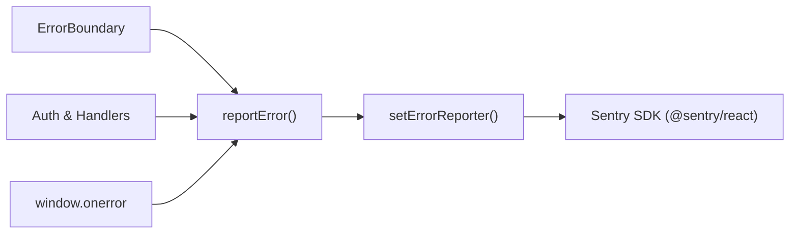

# Error Tracking & Monitoring

JobPulse decouples application error reporting from external monitoring SDKs. In development, errors log to the console. In production, errors are forwarded to [Sentry](https://sentry.io).

## Architecture

All application errors flow through [`src/lib/logger.ts`](../src/lib/logger.ts):

- **`reportError(error, context)`**: Main error reporting entry point across the app.
- **`setErrorReporter(callback)`**: Connects external telemetry reporters to the central logger.
- **`initGlobalErrorLogging()`**: Captures uncaught exceptions and unhandled promise rejections.
- **`ErrorBoundary`**: Catches React render tree crashes and forwards stack traces to `reportError`.

## Sentry Configuration

Sentry is initialized in [`src/lib/sentry.ts`](../src/lib/sentry.ts):

- **Default DSN**: Embedded production DSN in `src/lib/sentry.ts`.
- **Environment Override**: Set `VITE_SENTRY_DSN` in environment variables if targeting a different project.
- **User Identity**: Call `setSentryUser(userId)` with the authenticated `auth.uid()`. Never send candidate email or personal data.

## Content Security Policy (CSP)

To permit Sentry telemetry beacons, ensure Sentry ingestion domains are allowed in `connect-src`:

- **Directives**: `connect-src 'self' https://*.ingest.sentry.io https://*.ingest.de.sentry.io`
- **Locations**: Configured in [`index.html`](../index.html) and [`public/_headers`](../public/_headers).

## Privacy & PII Safeguards

- **No Personal Identifiers**: Never attach candidate email, resume text, salary, or contact details to error context.
- **Header Scrubbing**: `Authorization` and `apikey` headers are stripped in `beforeSend`.
- **Session IDs Only**: Only pseudonymous `auth.uid()` values may be associated with error reports.
