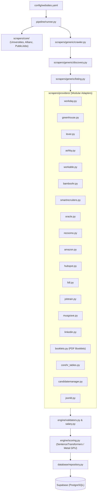

# Scraper Architecture & Ingestion Pipeline

`services/scraper/` discovers Irish employer openings, extracts job details, scores candidate fit, and writes to Supabase. The browser never loads the scraper's service role key.

## Data Flow

## Modular Components

1. **Configuration (`config/`)**:
   - `websites.yaml`: Employer watchlist, career URLs, sectors, and priority weights.
   - `loader.py`: Config parsing and tenant profile loading via immutable `user_id`.
   - `rules.py`: Default scoring criteria and negative domain penalties.

2. **Ingestion & Crawling (`scrapers/`)**:
   - `scrapers/core/`: Specialized scrapers for complex multi-step portals (PublicJobs, Allianz, DCU, Trinity, UCD, Maynooth, Housing Agency, IDA, Intel, Kerry).
   - `scrapers/generic/crawler.py`: Concurrent crawler with domain-level rate limiting (`BoundedSemaphore`).
   - `scrapers/generic/discovery.py`: Resolves career page redirects, SPA links, and auth walls.
   - `scrapers/generic/listing.py`: High-level dispatcher coordinating structured ATS providers and falling back to HTML link heuristics.
   - `scrapers/providers/`: Single-responsibility, stateless adapters for 20+ ATS systems (Workday CXS, Greenhouse, Lever, Ashby, Workable, BambooHR, SmartRecruiters, Oracle Cloud HCM, Personio, Teamtailor, Rezoomo, Amazon Jobs, HubSpot GraphQL, JobTrain, Lidl Ireland, Musgrave, LinkedIn cards, Candidate Information Booklet PDFs, CoreHR tables, and Schema.org JSON-LD).
   - `tools/harvest_boards.py`: Concurrent ATS board harvester and scanner (`make scrape-harvest`) to discover active Ireland vacancies across candidate employer boards and auto-promote verified sources into `websites.yaml`.

3. **Evaluation Engine (`engine/`)**:
   - `text_cleaner.py`: Description cleaning and HTML-to-Markdown normalization (`clean_job_description`), cookie banner and ATS boilerplate disclaimer stripping (EEOC, GDPR, security footers), section header markdown formatting (`### Header`), bullet point standardization (`- Item`), and location normalization. Raw descriptions are cleaned directly during ETL ingestion before database upsert, ensuring clean markdown across all downstream consumers.
   - `validators.py`: Filtering of non-job anchor links, generic documents, and invalid titles.
   - `salary.py`: Heuristic extraction and normalization of annual/daily Euro salary ranges.
   - `scoring.py`: Candidate fit calculation engine using dense semantic embeddings (`all-MiniLM-L6-v2` accelerated via Apple Silicon Metal MPS or CPU fallback), combined with title and seniority matching.

4. **Database Repository & Maintenance Safety (`database/`)**:
   - `client.py`: Thread-safe singleton Supabase client (`_client_lock`) using service-role credentials.
   - `repository.py`:
     - Multi-tenant evaluation upserts keyed strictly by `(user_id, job_id)`.
     - **Safe Deduplication**: Normalizes employer, title, and URL into `dedupe_key`. Transfers both `user_job_statuses` and `user_job_evaluations` by `user_id` before removing duplicate rows; fails closed if transfer errors or status conflicts occur.
     - **Safe Pruning**: Lifecycle cleanup of untracked postings older than retention window. Verifies `user_job_statuses` and halts immediately (`RuntimeError`) if status query fails, preventing accidental deletion of user-tracked jobs.

5. **Server & CLI (`server/`, `app.py`)**:
   - `app.py`: CLI commands (`--validate-config`, `--employer`, `--user-id`, `--server`). Binds to loopback `127.0.0.1` by default.
   - `server/api.py`: Lightweight HTTP daemon for sync triggers and catalog inspection. Limits request payloads (`MAX_REQUEST_BYTES = 64KB`), validates shapes, and enforces bearer token authorization on remote reads (`GET /api/profile`).

## Fit Scoring & Match Calculation Engine

The candidate match percentage (`relevance: 0–100%`) is calculated dynamically per opportunity and tenant profile in `services/scraper/engine/scoring.py`. It combines 12 multi-dimensional signals weighted according to the candidate's preferences:

1. **Semantic AI Similarity (Default max: 35 pts)**:
   - Uses `SentenceTransformer("all-MiniLM-L6-v2")` running on Apple Silicon Metal MPS (with CPU or tokenized TF-IDF cosine fallback).
   - Embeds candidate headline, career summary, target roles, qualifications, and certifications against the opportunity title and cleaned description text.
2. **Domain Alignment (Default max: 25 pts)**:
   - Evaluates positive domain patterns (`positive_domains` configured in profile). Full match yields 1.0 (title) or 0.8 (description).
   - Negative domain terms (`negative_domains`) heavily penalize the score, capping overall match at 15%.
3. **Seniority Alignment (Default max: 15 pts)**:
   - Evaluates title seniority tiers: Executive / Director / Lead / Senior / Mid-Level / Junior.
   - Applies tier weight multipliers from candidate's profile rules.
4. **Competencies, Tools & Certifications (Default max: 15 pts)**:
   - Scans job text for candidate-specified keywords, tools/software, and professional certifications.
   - Matches are tracked in `matched_skills` and boost competency score proportionally.
5. **Salary & Compensation Benchmark (Default max: 10 pts)**:
   - Compares advertised compensation against candidate's `minimum_salary`.
   - Meeting target yields 1.0; unadvertised positions default to 0.75 (neutral/market competitive); sub-target advertised salaries are penalized.
6. **Contract & Employment Type (Default max: 10 pts)**:
   - Permanent/indefinite appointments receive 1.0; fixed-term/temporary positions receive 0.55 with a configurable fixed-term penalty deduction.
7. **Target Role Match (Bonus: +8 pts)**:
   - Direct substring match between candidate's `target_roles` and job title.
8. **Location Preference (Bonus: up to +8 pts)**:
   - Priority-weighted based on position in `target_locations` (1st preference gets 100% bonus, 2nd gets 80%, etc., down to 40% floor).
9. **Work Mode Alignment (Bonus / Penalty)**:
   - Matches remote/hybrid/on-site preferences against job text (+5 pts match bonus; -4 pts if strictly on-site when remote/hybrid is preferred).
10. **Work Authorization & Visa Support**:
    - Right-to-work (EU / Stamp 4) satisfies requirements; roles explicitly rejecting visa sponsorship incur deductions for candidates requiring sponsorship.
11. **Disqualifiers & Dealbreakers**:
    - Disqualification patterns (e.g. required Irish language fluency when not spoken) cap final relevance at the profile dealbreaker threshold (default: 15%).
12. **Fit Tiers**:
    - `Strong Match`: $\ge 75\%$
    - `Good Match`: $55\% \le \text{score} < 75\%$
    - `Moderate Match`: $35\% \le \text{score} < 55\%$
    - `Low Match`: $15\% \le \text{score} < 35\%$
    - `Mismatch`: $< 15\%$

The scoring engine writes `{ relevance, fit_tier, matched_skills, ai_analysis: { reasoning, alignments, mismatches, sub_scores } }` to `user_job_evaluations`.

## Concurrency & Thread Safety

- **Client Singleton**: Database connection pool and PostgREST client initialization are guarded by `threading.Lock()`.
- **Model Inference**: SentenceTransformer model loading and tensor operations across concurrent crawler workers are synchronized via `threading.RLock()`.
- **Embedding Cache**: Candidate documents are hashed using SHA-256 for deterministic, collision-free embedding cache keys.

## Boundaries & Verification

- Configure sources in [`websites.yaml`](../services/scraper/config/websites.yaml), not scraper code.
- Never expose the service role key to frontend code.
- All Python linting and formatting runs via `uv run --locked` using the project virtualenv.
- Verify scraper code before changes with `make scrape-lint` and `make scrape-unit`.
