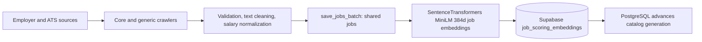

# Scraper Architecture & Ingestion Pipeline

`services/scraper/` is a vacancy data provider. It does not read profiles, evaluate candidates, or write `user_job_evaluations`.

## Data Flow

```mermaid
flowchart LR
    Sources[Employer and ATS sources] --> Crawlers[Core and generic crawlers]
    Crawlers --> Clean[Validation, text cleaning, salary normalization]
    Clean --> Jobs[save_jobs_batch: shared jobs]
    Jobs --> Embeddings[SentenceTransformers MiniLM 384d job embeddings]
    Embeddings --> DB[(Supabase job_scoring_embeddings)]
    DB --> Trigger[PostgreSQL advances catalog generation]
```

`pipeline/runner.py` coordinates the crawlers and catalog maintenance. Every adapter writes through `database/repository.py:save_jobs_batch`, which validates, cleans, deduplicates, and saves shared vacancy facts. Once each batch is persisted, `database/embeddings.py:prepare_embeddings` computes missing or changed `all-MiniLM-L6-v2` job vectors. The model runs locally with Apple Metal when available and CPU otherwise. It never loads a profile model or candidate data.

The statement trigger on `job_scoring_embeddings` advances one catalog generation. Candidate scoring is decoupled from ingestion and driven by the durable worker. User profile vectors are generated in a browser worker; profile/vector writes enqueue work atomically. `rescore_user` requests a retry or shortlist limit change and does not score synchronously. A completed request keeps at most 1,500 native evaluations. Catalog refreshes score only changed or missing facts. Score composition for weight changes happens in `get_jobs_page` and overview metrics from stored sub-scores.

The scraper hashes scoring job facts separately from the embedding document. A salary or location change updates the job vector row even if the encoded text is unchanged, which invokes the SQL trigger to refresh affected evaluations.

## Network policy

Shared public-page and ATS requests verify TLS first, then retry certificate errors
without certificate or hostname verification on any crawl host. Other connection
errors still fail. Supabase connections keep their own verified transport.
The fallback permits interception or alteration of public crawl traffic; it does
not extend to the database client or disable verification on the first attempt.

## Board catalog

`public.boards` is the source of truth for what the scraper visits: one row per
`(provider, board, region)` crawl target carrying the company, sector, priority,
careers URL, lifecycle status (`pending`/`active`/`rejected`/`retired`) and crawl
health. `config/websites.yaml` is the bootstrap seed and runtime fallback when the
catalog is unavailable. The importer additionally reads an optional
`config/board_seeds.yaml`; runtime fallback does not read that file.
An empty or disabled catalog stays authoritative.
The catalog and lookup indexes reload once per sync, including API-triggered runs.
`tools/import_boards.py --apply` seeds or refreshes the table, and
`tools/harvest_boards.py --apply` inserts newly discovered boards as `pending`. Each
board's `provider`/`board` identity drives crawling — the adapter is tried first, and a
canonical board URL is used when the configured careers URL hides the ATS behind a vanity
domain — and `employer_id` links a board to the employer registry
(`tools/backfill_board_employers.py`). The catalog is service-role-only (RLS enabled, no
browser grants) and carries no candidate data.

New boards are discovered by `tools/discover_boards.py`, which mines token-based ATS
board identities and inserts them as `pending`: `--source commoncrawl` sweeps Common
Crawl's CDX index, `--source jobs` recovers boards from postings already stored, and
`--source freehire` reads a public Ireland job index for board identities only. Every
posting is still crawled from the underlying ATS, so the catalogue stays first-party.

Each crawl records its outcome through `record_board_outcome`: success promotes a proven
`pending` board to `active` and clears failures; failure increments `consecutive_failures`
and cools the board down (no cooldown below 3 failures, then `6h * 2^(f-3)` capped at 24h).
`sync_watchlist_employers` skips boards whose `cooldown_until` is still open, and a health
write never discards a completed crawl. JSON listing adapters distinguish verified empty
results from request, payload and pagination failures. Verified boards with no Irish roles
use a weekly cooldown. A board that resolves to no existing employer can
create one through the shared employer lookup service (`tools/backfill_board_employers.py
--create`), so discovered companies join the registry instead of staying unlinked.

`get_overview_metrics` reads shared facets (total, locations, canonical sectors) from the
one-row `catalog_stats` rollup refreshed by `refresh_catalog_stats()` at the end of each
scrape. Per-user
metrics are derived from the caller's evaluations and statuses for open postings.
Statement triggers on jobs and employers invalidate the rollup in the write transaction,
including updates that preserve the job count. An invalid rollup falls back to a live
computation; refresh serializes with invalidation before marking the facets valid.

Automatic archival is disabled. Neither a board health timestamp nor a source sync
timestamp proves that a particular vacancy closed: failed, empty and partial crawls
must preserve existing postings. `close_stale_jobs` is a bounded service-only no-op
for compatibility until vacancy-specific closure evidence is implemented. Explicitly
closed postings retain candidate history but are excluded from live overview metrics.

## CLI and API

`scrapers/registry.py` owns specialized feeds, including JobsIreland, 4dayweek.io,
JobStash and Google alongside council, university and employer scrapers. Aggregator
records supply each posting's employer; nested company objects are reduced to their
name before persistence. Paginated Google, JobStash and 4dayweek requests retain
existing vacancies on listing failures or pagination limits and report incomplete
ingestion, including any rows already persisted.

- `make scrape` crawls all configured employers and saves jobs and embeddings.
- `make scrape-boards ARGS="--limit 50"` crawls only a bounded set of live boards.
- `make scrape-list-boards` inspects catalog targets without writes; `--list-websites`
  remains the YAML-seed inspection command.
- `make scrape-backfill` prepares missing vectors for an existing catalog without crawling.
- `make scrape-test NAME="Employer Name"` limits the crawl to one employer.
- `make scrape-core` runs core sources only.
- `make scrape-validate` checks source configuration.
- The optional local API supports operator/external integrations. The current dashboard reads Supabase directly, not this API. It exposes catalog and sync endpoints, never profiles or candidate evaluations. Preserve its compatibility surface until deployed consumers are inventoried.

Discovery and standalone enrichment wrappers are documented in the
[operating workflow](OPERATIONS.md#scraping-and-matching-workflow). Matching runs
in PostgreSQL after vector writes; there is no separate scraper scoring command.

The API permits token-free requests only from loopback clients with no `Origin`
header (local CLI tools), or the exact local dashboard origins
`http://localhost:5173` and `http://127.0.0.1:5173`. Untrusted browser origins
are rejected before catalog reads or sync execution, including simple POSTs
that do not need a CORS preflight.

For an external dashboard, set `JOBPULSE_ALLOWED_ORIGIN` to its exact origin
(scheme, hostname and optional port, without a path or trailing slash) and set
`JOBPULSE_API_TOKEN`. Send the token as `Authorization: Bearer <token>`.
Setting a token requires it for all protected requests, including local clients;
external origins and non-loopback clients cannot use token-free access. Origin
checks apply even with a valid token. Health/version endpoints remain public.
Wildcard tunnel domains are never trusted implicitly.

## Safety

The scraper service role key stays in the local process. Candidate records remain behind Supabase RLS. Deduplication transfers user statuses and evaluations through the service-only database RPC before deleting a duplicate. Age, an empty crawl or source failure never authorizes vacancy deletion. The retired `--prune-only` command is rejected; the old SQL pruning RPC is retained only as a no-op for deployed callers. The scraper never returns candidate data in API responses.

Full sync responses retain `prune_stats: {}` for compatibility with existing consumers;
there is no pruning phase. New retirement behavior requires source-specific closure
evidence, preservation of candidate tracking and regression tests. See
[Regression Prevention](REGRESSION_PREVENTION.md).

Run `make scrape-lint` and `make scrape-unit` after changes to this service.

## Full description ingestion

Ingestion retrieves missing posting details by default and preserves complete API
bodies rather than listing snippets. Failed detail requests cannot erase a stored
body, and new metadata-only listings are not embedded. The catalog repair command
updates descriptions in place, preserving job IDs and candidate tracking. Job
embeddings cover the complete body through token windows. See
[Published job descriptions and semantic coverage](OPERATIONS.md#published-descriptions)
for repair commands, body-gate limits and unresolved-source handling.

## Employer metadata and vacancy locations

Employer identity resolution uses exact case-insensitive database names with literal
wildcard escaping and rejects ambiguous matches. Explicit curated aliases may resolve
known companies; no substring identity search or public geocoding runs during ingestion.
Failed persistence never caches an employer without an ID.

Employer headquarters remain in `employers`; published vacancy locations stay in `jobs`.
Ingestion accepts only complete, finite posting coordinate pairs, preserves zero values,
and writes `coordinate_source='posting'`. Legacy coordinates remain stored with unknown
provenance and are hidden in paginated results and deep-link details.

`employers.metadata_source` distinguishes `curated`, `watchlist`, `verified`, and
`unverified` metadata. Trusted `employers.sector` values define the single public
catalog sector; unknown and historical inferred values contribute `Uncategorized`.
Overview `categories` and page `p_sector` share this definition. Candidate role-sector assessments
remain private scoring inputs; this display classification does not rewrite them.
Match averages include assessed jobs only.

After persistence, a bounded employer-office worker researches distinct company/place
pairs and saves additive addresses, coordinates and website/category evidence. It uses
persistent retry dates rather than repeating research for each vacancy. The map's
separate office layer labels workplaces as unconfirmed; vacancy facts remain independent.
See [employer office enrichment](OPERATIONS.md#employer-research-and-offices).

After persistence, when `GEOAPIFY_API_KEY` is configured, the synchronization runner
checks up to 100 pending job locations through a separate bounded verification stage.
It caches external results, records each job's original location and precision, and
never substitutes employer headquarters. Provider failures do not roll back ingestion.
See [job location verification](OPERATIONS.md#vacancy-location-verification).

Employer linking and metadata enrichment are separate from ingestion. Shared metadata
writes require reviewed exact identity and field evidence, with compare-and-set guards;
vacancy titles or model output alone are not verification. Programme sponsorship does
not establish a client's industry. Research produces proposals; only the reviewed
registry/stored-witness workflow promotes metadata. See
[reviewed employer operations](OPERATIONS.md#reviewed-employer-metadata) for commands,
evidence formats and historical location repair.

## External company research

`tools/research_employers.py` reads linked employer identities from stored JobsIreland
catalog rows, independently of job-board availability. Provider access
and the response cache live in `pipeline/company_research.py`; Wikidata supplies
company discovery and Geoapify supplies explicit street-address geocoding. Results
are review proposals, never ingestion-time industry or vacancy-location inference.
Reviewed metadata can be previewed/applied through `tools/enrich_employers.py --registry`.
See [the operational guide](OPERATIONS.md#employer-research-and-offices) for configuration and evidence rules.
