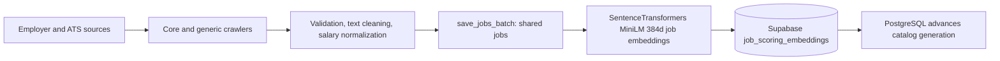

# Scraper Architecture & Ingestion Pipeline

`services/scraper/` is a vacancy data provider. It does not read profiles, evaluate candidates, or write `user_job_evaluations`.

## Data Flow

```mermaid
flowchart LR
    Sources[Employer and ATS sources] --> Crawlers[Core and generic crawlers]
    Crawlers --> Clean[Validation, text cleaning, salary normalization]
    Clean --> Jobs[save_jobs_batch: shared jobs]
    Jobs --> Embeddings[SentenceTransformers MiniLM 384d job embeddings]
    Embeddings --> DB[(Supabase job_scoring_embeddings)]
    DB --> Trigger[PostgreSQL advances catalog generation]
```

`pipeline/runner.py` coordinates the crawlers and catalog maintenance. Every adapter writes through `database/repository.py:save_jobs_batch`, which validates, cleans, deduplicates, and saves shared vacancy facts. Once each batch is persisted, `database/embeddings.py:prepare_embeddings` computes missing or changed `all-MiniLM-L6-v2` job vectors. The model runs locally with Apple Metal when available and CPU otherwise. It never loads a profile model or candidate data.

The statement trigger on `job_scoring_embeddings` advances one catalog generation. Candidate scoring is decoupled from ingestion and driven by the durable worker. User profile vectors are generated in a browser worker; profile/vector writes enqueue work atomically. `rescore_user` requests a retry or shortlist limit change and does not score synchronously. A completed request keeps at most 1,500 native evaluations. Catalog refreshes score only changed or missing facts. Score composition for weight changes happens in `get_jobs_page` and overview metrics from stored sub-scores.

The scraper hashes scoring job facts separately from the embedding document. A salary or location change updates the job vector row even if the encoded text is unchanged, which invokes the SQL trigger to refresh affected evaluations.

## CLI and API

- `make scrape` crawls all configured employers and saves jobs and embeddings.
- `make scrape-backfill` prepares missing vectors for an existing catalog without crawling.
- `make scrape-test NAME="Employer Name"` limits the crawl to one employer.
- `make scrape-core` runs core sources only.
- `make scrape-validate` checks source configuration.
- The local API exposes catalog and sync endpoints. It does not expose profiles or candidate evaluations.

The API permits token-free requests only from loopback clients with no `Origin`
header (local CLI tools), or the exact local dashboard origins
`http://localhost:5173` and `http://127.0.0.1:5173`. Untrusted browser origins
are rejected before catalog reads or sync execution, including simple POSTs
that do not need a CORS preflight.

For an external dashboard, set `JOBPULSE_ALLOWED_ORIGIN` to its exact origin
(scheme, hostname and optional port, without a path or trailing slash) and set
`JOBPULSE_API_TOKEN`. Send the token as `Authorization: Bearer <token>`.
Setting a token requires it for all protected requests, including local clients;
external origins and non-loopback clients cannot use token-free access. Origin
checks apply even with a valid token. Health/version endpoints remain public.
Wildcard tunnel domains are never trusted implicitly.

## Safety

The scraper service role key stays in the local process. Candidate records remain behind Supabase RLS. Deduplication transfers user statuses and evaluations through the service-only database RPC before deleting a duplicate. Age, an empty crawl or source failure never authorizes vacancy deletion. The retired `--prune-only` command is rejected; the old SQL pruning RPC is retained only as a no-op for deployed callers. The scraper never returns candidate data in API responses.

Full sync responses retain `prune_stats: {}` for compatibility with existing consumers;
there is no pruning phase. New retirement behavior requires source-specific closure
evidence, preservation of candidate tracking and regression tests. See
[Regression Prevention](REGRESSION_PREVENTION.md).

Run `make scrape-lint` and `make scrape-unit` after changes to this service.

## Full description ingestion

Ingestion retrieves missing posting details by default and preserves complete API
bodies rather than listing snippets. Failed detail requests cannot erase a stored
body, and new metadata-only listings are not embedded. The catalog repair command
updates descriptions in place, preserving job IDs and candidate tracking. Job
embeddings cover the complete body through token windows. See
[Published job descriptions and semantic coverage](JOB_DESCRIPTION_COMPLETENESS.md)
for repair commands, body-gate limits and unresolved-source handling.

## Employer metadata and vacancy locations

Employer identity resolution uses exact case-insensitive database names with literal
wildcard escaping and rejects ambiguous matches. Explicit curated aliases may resolve
known companies; no substring identity search or public geocoding runs during ingestion.
Failed persistence never caches an employer without an ID.

Employer headquarters remain in `employers`; published vacancy locations stay in `jobs`.
Ingestion accepts only complete, finite posting coordinate pairs, preserves zero values,
and writes `coordinate_source='posting'`. Legacy coordinates remain stored with unknown
provenance and are hidden in paginated results and deep-link details.

`employers.metadata_source` distinguishes `curated`, `watchlist`, `verified`, and
`unverified` metadata. Unknown sectors are `Uncategorized`; historical inferred sectors
are excluded from established industry facets until evidence is supplied. Overview
`sectors` and `p_sector` filter the same shared catalog population. Overview `categories`
and `p_domain` remain tenant-specific role classifications, including `Uncategorized`
for unassessed jobs. Sector averages use assessed jobs only. The canonical SQL scorer
owns matching; employer industry is display metadata and does not modify scoring factors.

`make scrape-backfill-employers` is read-only by default. Set `ARGS="--apply --limit 100"`
to link a bounded scan. It uses ID keyset pagination, counts unresolved rows toward the
limit, and guards writes against concurrent company/link changes. It never substitutes
headquarters or increments scoring generations.

For proven historical headquarters substitutions, `tools/repair_employer_locations.py`
reads only the public catalog section of the approved pre-enrichment snapshot. Supply
`--snapshot PATH --report PATH` to review proposed restorations, then `--apply` to perform
identity/location compare-and-set writes. It refreshes scoring documents/hashes through
`prepare_embeddings`; a retry refreshes already restored matching facts too. No private
snapshot data is imported or used as fixtures.
