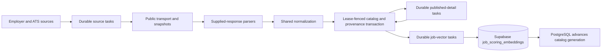

# Scraper Architecture & Ingestion Pipeline

`services/scraper/` is a vacancy data provider. It does not read profiles, evaluate candidates, or write `user_job_evaluations`.

## Package and boundaries

The installable `jobpulse_scraper` package lives in `services/scraper/src/jobpulse_scraper/`.
`jobpulse-scraper` and `python -m jobpulse_scraper.app` expose the CLI; the service-root
`app.py` keeps existing Makefile and script invocations working. Packaged YAML/JSON
resources load relative to the package. `JOBPULSE_SCRAPER_HOME` selects an explicit
service home and `JOBPULSE_CRAWL_STATE` selects writable crawl state. The editable
checkout defaults to `.backups/crawler/`; an installed wheel defaults to its working
directory's `.backups/crawler/`.

Paths in the module table are relative to the package root:

| Boundary | Modules | Contract |
| --- | --- | --- |
| Published facts | `contracts.py` | Immutable targets/responses, typed transport protocol, raw vacancy models and explicit result counts |
| Parsing | `scrapers/parsers/` | Supplied-response functions import neither acquisition nor persistence; ATS JSON, HTML, XML and embedded feed parsers remain replayable |
| Acquisition | `scrapers/adapters.py`, `scrapers/requests.py`, `scrapers/providers/` | Typed GET/POST requests and injected request openers control bounded pagination and permitted endpoint recovery |
| Compatibility workflows | `scrapers/core/`, `scrapers/generic/` | Supported synchronous commands compose acquisition, normalization and ingestion |
| Public transport | `network/transport.py`, `network/http_client.py`, `network/browser.py` | Injected HTTP/browser transports share pacing, denial handling and response bounds |
| Catalog normalization | `engine/normalization.py` | Pure identities preserve canonical requisition URLs and PostgreSQL dedupe keys |
| Detail extraction | `pipeline/detail_enrichment.py`, `extractors/` | Published detail hydration preserves listing facts and existing bodies on failure |
| Persistence | `database/ingestion.py`, `database/repository.py` | Catalog writes and maintenance contain no candidate evaluation loop |
| Durable execution | `runtime/queue.py`, `runtime/lease.py` | Database leases fence source writes, vectors and completion; detail/vector tasks retry independently |
| Replay | `snapshots.py`, `network/recording.py` | Bounded public responses use content checksums and an injected metadata sink |

Composition keeps parsers reusable by fixtures, snapshot replay and alternate
execution engines. Stateful classes own transport, queue or storage lifecycles;
pure transformations remain functions. Provider compatibility functions accept a typed
`RequestOpener`; the primary adapter contract accepts an injected `Transport`. These boundaries follow the dependency
inversion and small-abstraction principles in
[Architecture Patterns with Python](https://www.cosmicpython.com/book/chapter_02_repository)
and its [coupling chapter](https://www.cosmicpython.com/book/chapter_03_abstractions).

Workday starts with a keyword-free public listing probe, then uses published Irish
country or location facet IDs when available. Pagination retains those facets.
Ambiguous locations require an entirely Irish returned facet scope; missing
locations alone do not establish Irish eligibility. The compatibility provider
uses the same adapter and page bound, and an unfinished listing fails explicitly.
Linked Elementor vacancy cards use their own title and Irish location evidence.
Generic links keep unknown locations empty instead of borrowing a neighboring
card's location. Detail enrichment supplies additional published facts.
Rezoomo company pages can use either the canonical company path or a published
tenant subdomain; both resolve to the same company-slug listing request. Its
parser retains only published locations, and leaves unavailable descriptions
empty for durable detail enrichment instead of generating vacancy filler text.

## Data Flow

```mermaid
flowchart LR
    Sources[Employer and ATS sources] --> Tasks[Durable source tasks]
    Tasks --> Transport[Public transport and snapshots]
    Transport --> Parsers[Supplied-response parsers]
    Parsers --> Clean[Shared normalization]
    Clean --> Jobs[Lease-fenced catalog and provenance transaction]
    Jobs --> Details[Durable published-detail tasks]
    Jobs --> Vectors[Durable job-vector tasks]
    Details --> Jobs
    Vectors --> DB[(Supabase job_scoring_embeddings)]
    DB --> Trigger[PostgreSQL advances catalog generation]
```

`pipeline/runner.py` preserves synchronous CLI/API synchronization. Durable workers
use typed adapters where available and the supported specialized acquisition paths
for other sources. `database/ingestion.py:save_jobs_batch` validates, cleans and saves
shared vacancy facts. Durable writes enqueue detail or vector tasks in the same
transaction; synchronous compatibility calls hydrate and prepare vectors inline.
`database/embeddings.py:prepare_embeddings` computes missing or changed
`all-MiniLM-L6-v2` job vectors. The model uses Apple Metal when available and CPU
otherwise, and reads no profile or candidate data. Core reports carry explicit
counts while preserving two-value Python unpacking; health never parses display text.

The statement trigger on `job_scoring_embeddings` advances one catalog generation. Candidate scoring is decoupled from ingestion and driven by the durable worker. User profile vectors are generated in a browser worker; profile/vector writes enqueue work atomically. `rescore_user` requests a retry or shortlist limit change and does not score synchronously. A completed request keeps at most 1,500 native evaluations. Catalog refreshes score only changed or missing facts. Score composition for weight changes happens in `get_jobs_page` and overview metrics from stored sub-scores.

The scraper hashes scoring job facts separately from the embedding document. A salary or location change updates the job vector row even if the encoded text is unchanged, which invokes the SQL trigger to refresh affected evaluations.

## Network policy

Public HTTP requests verify TLS first and retry certificate errors with verification
disabled. Browser contexts ignore public-source certificate errors. Supabase keeps
its own verified HTTP client. Connection/protocol failures remain source failures.

The request gate reserves host slots in a local SQLite transaction before sleeping.
Independent worker processes share host pacing and durable cooldowns on one machine;
separate machines require their own coordinated deployment policy. Redirects, TLS
fallbacks and transient retries use the gate. Async browser document/XHR requests
keep the configured interval; required scripts/stylesheets reserve shared host slots
at up to ten starts per second with four concurrent asset transfers. Learned denial
intervals and cooldowns override asset pacing. Each browser session admits at most
128 requests and blocks images, fonts, media, beacons, known tracking hosts and
known optional embedded-media hosts before their responses can affect denial
learning for the job source.
Browser callbacks await pacing without blocking the event loop. Generic navigation
uses one DOM-content-loaded attempt with a thirty-second cap and bounded rendering
settle time. Denials and `Retry-After` stop further
host requests, including fallback transport attempts. Source observations record
accepted responses, denials, timestamps and server retry directions; accepted samples
never establish a safe request ceiling. See [request operations](OPERATIONS.md#request-pacing-and-bounded-observations).

HTTP responses explicitly marked `x-amzn-waf-action: challenge` or `captcha`
are blocked source data even when the status is 202. HTTP stops after that
observation and retains the actual status with its challenge flag and cooldown.
An ordinary 202 remains an ordinary response. Browser rendering retains its
existing bounded interstitial settling behavior.

## Durable work, provenance and replay

`crawl_tasks`, `crawl_runs`, `crawl_snapshots` and `job_occurrences` are backend-only
public-source operational tables: RLS is enabled and browser roles receive no grants.
Claims use `FOR UPDATE SKIP LOCKED`, renewable leases and unique fencing tokens.
An expired claim records an expired attempt and permits recovery; stale tokens cannot
write vacancies, snapshots, vectors or completion. Retry dates and bounded attempts
survive process termination. Candidate matching remains in its existing SQL queue.

A catalog write records the source identity, provider ID or canonical posting URL,
content hash and available snapshot link. Deduplication transfers observations and
candidate tracking to the retained job. Metadata-only listings remain catalog rows;
failed source/detail requests do not close or delete vacancies. Vector writes compare
the current scoring facts with the inference snapshot before accepting output.

Snapshots contain public bodies and sanitized public URLs, never authorization headers,
cookies, credentials or candidate records. Local storage enforces a 16 MiB body limit,
a 5 GiB aggregate limit, at most 10,000 files and thirty-day retention under a
process-safe lock. New bodies are compressed when this saves space; when the aggregate
budget is reached, older raw body files are compressed in place without changing their
content hashes, metadata keys or thirty-day retention. Replay accepts both compressed
and legacy raw bodies, validates metadata/body checksums and invokes the registered
parser without network or database writes. Snapshot-budget failures have their own
error category instead of appearing as malformed source payloads. Registered adapter pages receive replayable
snapshots. Durable compatibility workflows retain source provenance
and transport observations; their occurrence snapshot link can be null. SQL history retention removes snapshots
older than thirty days or beyond 10,000 rows, and finished runs older than thirty days
or beyond 100,000 rows; provenance remains when its snapshot expires. Workers invoke `purge_crawl_history()` with service credentials before a bounded drain.
Automatic `make scrape` startup uses the service-only `enqueue_crawls_if_idle`
RPC with per-source eligibility. Concurrent starters serialize through a
transaction-scoped advisory lock. Pending/running source tasks stay untouched;
future retries do not block other eligible sources. Startup sends batches of at most
1,000 targets and 4 MiB of serialized JSON, below the database's 8 MiB budget.
Each batch commits atomically; repeated startup safely resumes after a later batch
fails because already pending sources remain unchanged. Completed sources wait six hours from
`last_succeeded_at`. Failed source crawls receive a six-hour minimum retry date,
with longer remote delays preserved. Detail/vector tasks keep independent backoff,
and exhausted tasks require explicit enqueueing. Only successful fenced completion
advances the successful timestamp.
Repeated scheduling preserves pending targets, retry attempts and retry dates; it
starts a new attempt cycle only for completed or dead work.
Due claims prefer the next source/detail/vector kind based on the latest committed
claim, while retaining nonblocking `SKIP LOCKED` ownership. Expired leases recover
first. Source selection gives registered adapters three turns before yielding to
generic discovery when both queues have work; concurrent claims can share a turn.
The service-only scheduling query uses the indexed run history.

Catalog consolidation groups canonical posting URLs and requires agreeing titles,
locations and closure states. Provider-native posting references permit source
aliases to converge while conflicting URL groups remain separate. Ingestion reuses
a confirmed existing key and existing employer label; automatic drains run a
bounded consolidation pass through the service-only tracking-preserving merge RPC.
Python never reads or rewrites private tracking to decide a merge. Tracking conflicts
and RPC failures are reported; age and source failures never authorize retirement.
Concurrent initial publication can create alias copies until post-drain maintenance.

Posting availability is independent of candidate stages and `last_seen_at`.
`availability_status`, `availability_checked_at` and `availability_evidence` store
public evidence. PostgreSQL computes active confirmation expiry after 24 hours;
uncertainty and failed sources never authorize closure. Live fenced source writes
confirm observed listings; detail/vector persistence cannot invent confirmation or
reopen a closed posting. The service-only `record_job_availability` RPC guards the
original URL/title and retains closure when a later acquisition fails. It rejects
active writes even from service role. Only live fenced source publication promotes
a job to active; positive standalone verification remains an observation.

`scrapers/parsers/availability.py` classifies synthetic or acquired pages without
network/database imports. `engine/html_body.py` supplies shared pure description
containers. `network/posting_transport.py` validates and pins public DNS addresses,
preserves host pacing/cooldowns, caps responses at 2 MiB and refuses redirects.
`pipeline/job_availability.py` runs at most four reusable subprocess slots with
20-second deadlines and a single parent database writer. Its bounded preview/apply
command archives public outcome IDs, evidence and timings alongside ignored logs.
The parser confirms only a matching posting; generic pages, ambiguous identities,
unsupported bodies and denials remain unverified.

Automatic drains use four concurrent task slots sharing one 50,000-task budget.
`--concurrency` accepts one to four slots; explicit workers default to one.
Each slot owns a reusable spawned process, preserving warm clients/models and
setting the current lease/source context for each task. A 120-second default hard
deadline includes acquisition and persistence; `--task-timeout` accepts 1–3,600
seconds. Timeout or interruption terminates task descendants before completion or
lease release. A timeout records `task_deadline_exceeded` as incomplete; committed
partial catalog facts remain intact and retries keep their existing policy.
Synthetic cancellation, crash recovery, asset rendering and pool-budget tests
enforce these contracts. Candidate matching is independent of these slots.

The shared Supabase HTTP client uses a twenty-second transport timeout. Claims
retry transient HTTP transport errors at most three times, with 0.4- and
0.8-second backoff. Each failed request reserves a shared task-budget slot because
its database claim can commit without a delivered response. Unknown leases recover
through normal expiry; workers never release them without a fencing token.
`claim_transport_error` reports bounded retry progress without exception content.
Exhausted retries or claim budget raise the transport failure; database contract
errors fail immediately. `services/scraper/tests/test_durable_worker.py` verifies
bounded claims, concurrent recovery and failure visibility;
`services/scraper/tests/test_database_client.py` verifies the transport timeout.

Source acquisition measurements live in the shared local SQLite ledger and in
`crawl_runs.result.acquisition_metrics`, linked through each task to its configured
source and company. Sent attempts, replies, transport/resource counts, wall-time
request rates, host denials, preceding-minute host traffic, retry delays, learned
intervals and ingestion-input field coverage remain separate measurements.
Stage measurements separate host pacing, HTTP open/body reads, catalog reads,
detail extraction, catalog persistence and vector preparation. Stages are inclusive:
redirect pacing can overlap HTTP open, and detail extraction includes transport.
Reports retain summed worker durations; neither nested stages nor concurrent task
durations can be summed as elapsed runtime. Missing stage measurements remain unknown.
JobsIreland detail bodies use exact-URL hashed identities in a local six-hour cache.
Only positively parsed bodies are retained, with a 64 KiB body ceiling and at most
1,000 entries. Larger bodies remain complete but bypass caching; unavailable,
mismatched-reference and challenge responses never enter the cache. Cached bodies
stay out of diagnostics. Existing usable catalog bodies satisfy stale detail tasks
without another request. Source refresh retains its independent freshness contract.
Diagnostic run IDs hash the task/lease pair; acquisition JSON logs contain no lease credentials,
request bodies, query parameters or vacancy text. Local measurements retain at
most 50,000 events for 30 days; source profiles retain at most 10,000 identities
for 30 days. Existing SQL history retention bounds durable run results.

Generic sources remember positive extraction or an explicit empty-board signal
for their exact company/configured URL. A recent browser preference skips HTTP
discovery; browser failure or unusable extraction falls back to HTTP once.
Preferences expire after seven days or three failed crawls, including deadlines.
Verified query-free HTTP(S) destinations also bind to the configured company/URL,
expire after seven days and are discarded after unsuccessful use. They bypass
repeated redirect/discovery hops without changing catalog or job identities.
Routes exclude credentials, query strings and fragments and retain at most 10,000
entries for 30 days in the local ledger.
Registered adapters take precedence. A recent positive profile can restore from
the latest successful durable run when local state is absent; it cannot reset
equal/newer local failure evidence. Repeated 429 responses double the learned
host interval up to 60 seconds without reducing the configured floor or cooldown.
An observed denial ordinal is evidence about that run, never a safe quota.

Generic discovery normalizes URLs within one source attempt and skips candidates
already visited, including redirect-equivalent pages. This avoids duplicate
discovery requests while provider adapters retain their own continuation and page
budgets. A page with no Ireland-qualified results does not establish that later
provider pages are empty.

Presentation locale segments such as `en-US` and query names such as `id` never
count as vacancy geography. Geography checks inspect location/title text and the
URL path, excluding host names, query parameters and fragments.
Published location text and geographic URL paths still enforce foreign-location
rejection. Detail tasks report incomplete when persistence writes no vacancy;
a fetched body alone cannot establish successful catalog repair. Verified concise
JobsIreland requirements remain valid regardless of length, while empty fields,
placeholders, mismatched references and closure notices remain unavailable.

iCIMS uses the public server-rendered `/jobs/search` route with `in_iframe=1`,
without generic browser discovery. The pure parser accepts Location/Job Locations
labels and keeps only explicitly Irish alternatives from a multi-location card.
Pagination follows published next links on the same HTTPS listing origin, up to
20 pages; foreign-only pages do not stop continuation. Responses without listing
markers remain failures, and missing descriptions stay eligible for detail repair.

SmartRecruiters listing requests use its documented `country=ie` filter and
carry that filter across offset pages. The parser still validates each returned
location as Ireland; a filtered empty result remains bounded source evidence,
not proof that an employer has no vacancies. Synthetic pagination tests enforce
the request and continuation contract.

Ashby board names containing spaces are accepted only as `%20` in the path and
are passed unchanged to the fixed public API origin. Encoded path separators
remain invalid; provider-detection tests enforce both cases.

`make scrape-report` compares the latest 100 finished runs, optionally filtered
by company. It distinguishes unmeasured history, reports weighted request rates,
description-body coverage and the latest measured duration change. Coverage
describes input fields, not proof that every published vacancy or full body is
captured. Source/detail tasks remain separate; missing salary is not fabricated.
CLI durable drains automatically archive this report with owner-only permissions,
including incomplete drains. Report failures do not undo completed work and remain
visible as a failing command. Batch campaign review follows the
[agent process](../AGENTS.md#scraper-measurement-and-improvement-process).

Greenhouse listing requests include descriptions with `content=true`, as defined
by the [Job Board API](https://docs.greenhouse.io/job-board.html). A full-body
response exceeding the existing byte budget falls back once to metadata;
durable detail work supplies missing bodies. Denials never trigger that recovery.
HubSpot's supported Greenhouse recovery also requests published descriptions.
Synchronous core/watchlist entry points use independent source scopes and retain
measurements in the local ledger and logs. They preserve an existing durable run
context when called by a worker. Only durable tasks write `crawl_runs` results.

PDF detail extraction accepts at most 10 MiB, 100 pages and 200,000 extracted
characters. Catalog identity URLs retain their original values; public acquisition
encodes invalid wire characters such as spaces. Role-specific booklet links stay on
the official origin and exclude unrelated privacy documents.

## Execution engine decision

The runtime uses composed adapters with PostgreSQL durability. `make scrape-pilot`
compares this executor with Scrapy on synthetic ATS JSON, paginated HTML and real
Chromium rendering. The executable contract requires identical vacancy records and
only one remote request after a denial, under the same host pacing. This workload
does not establish a material Scrapy throughput benefit, so production does not
require Scrapy. Scrapy lives in the evaluation/development dependency group.

Reevaluate the engine when broad HTML frontiers require its spider scheduler,
duplicate filtering or downloader middleware. Keep database leases and candidate
boundaries authoritative if an additional engine is introduced. Scrapy's
[architecture](https://docs.scrapy.org/en/latest/topics/architecture.html) and
[embedded crawler APIs](https://docs.scrapy.org/en/latest/topics/practices.html)
provide the extension points; the parser contract remains independent of them.

## Board catalog

`public.boards` is the source of truth for what the scraper visits: one row per
`(provider, board, region)` crawl target carrying the company, sector, priority,
careers URL, lifecycle status (`pending`/`active`/`rejected`/`retired`) and crawl
health. `config/websites.yaml` is the bootstrap seed and runtime fallback when the
catalog is unavailable. The importer additionally reads an optional
`config/board_seeds.yaml`; runtime fallback does not read that file.
An empty or disabled catalog stays authoritative.
The catalog and lookup indexes reload once per sync, including API-triggered runs.
`tools/import_boards.py --apply` seeds or refreshes the table, and
`tools/harvest_boards.py --apply` inserts newly discovered boards as `pending`. Each
board's `provider`/`board` identity drives crawling — the adapter is tried first, and a
canonical board URL is used when the configured careers URL hides the ATS behind a vanity
domain — and `employer_id` links a board to the employer registry
(`tools/backfill_board_employers.py`). The catalog is service-role-only (RLS enabled, no
browser grants) and carries no candidate data.

New boards are discovered by `tools/discover_boards.py`, which mines token-based ATS
board identities and inserts them as `pending`: `--source commoncrawl` sweeps Common
Crawl's CDX index, `--source jobs` recovers boards from postings already stored, and
`--source freehire` reads a public Ireland job index for board identities only. Every
posting is still crawled from the underlying ATS, so the catalogue stays first-party.

Each crawl records its outcome through `record_board_outcome`: success promotes a proven
`pending` board to `active` and clears failures; failure increments `consecutive_failures`
and cools the board down (no cooldown below 3 failures, then `6h * 2^(f-3)` capped at 24h).
`sync_watchlist_employers` skips boards whose `cooldown_until` is still open, and a health
write never discards a completed crawl. JSON listing adapters distinguish verified empty
results from request, payload and pagination failures. Verified boards with no Irish roles
use a weekly cooldown. A board that resolves to no existing employer can
create one through the shared employer lookup service (`tools/backfill_board_employers.py
--create`), so discovered companies join the registry instead of staying unlinked.

`get_overview_metrics` reads shared facets (total, locations, canonical sectors) from the
one-row `catalog_stats` rollup refreshed by `refresh_catalog_stats()` at the end of each
scrape. Per-user
metrics are derived from the caller's evaluations and statuses for open postings.
Statement triggers on jobs and employers invalidate the rollup in the write transaction,
including updates that preserve the job count. An invalid rollup falls back to a live
computation; refresh serializes with invalidation before marking the facets valid.

Automatic archival is disabled. Neither a board health timestamp nor a source sync
timestamp proves that a particular vacancy closed: failed, empty and partial crawls
must preserve existing postings. `close_stale_jobs` is a bounded service-only no-op
for compatibility until vacancy-specific closure evidence is implemented. Explicitly
closed postings retain candidate history but are excluded from live overview metrics.

## CLI and API

`scrapers/registry.py` owns specialized feeds, including JobsIreland, 4dayweek.io,
JobStash and Google alongside council, university and employer scrapers. Aggregator
records supply each posting's employer; nested company objects are reduced to their
name before persistence. Paginated Google, JobStash, 4dayweek and JobsIreland requests
retain existing vacancies on listing failures or pagination limits and report incomplete
ingestion, including any rows already persisted.

- `make scrape` crawls all configured employers and saves jobs and embeddings.
- `make scrape-boards ARGS="--limit 50"` crawls only a bounded set of live boards.
- `make scrape-list-boards` inspects catalog targets without writes; `--list-websites`
  remains the YAML-seed inspection command.
- `make scrape-backfill` prepares missing vectors for an existing catalog without crawling.
- `make scrape-test NAME="Employer Name"` limits the crawl to one employer.
- `make scrape-core` runs core sources only.
- `make scrape-validate` checks source configuration.
- The optional local API supports operator/external integrations. The current dashboard reads Supabase directly, not this API. It exposes catalog and sync endpoints, never profiles or candidate evaluations. Preserve its compatibility surface until deployed consumers are inventoried.

Discovery and standalone enrichment wrappers are documented in the
[operating workflow](OPERATIONS.md#scraping-and-matching-workflow). Matching runs
in PostgreSQL after vector writes; there is no separate scraper scoring command.

The API permits token-free requests only from a direct loopback connection
(`127.0.0.1`/`::1` peer, a loopback `Host`, and no forwarding headers) with no
`Origin` header (local CLI tools), or the exact local dashboard origins
`http://localhost:5173` and `http://127.0.0.1:5173`. A request that arrived through
a proxy or tunnel carries forwarding headers, so its loopback peer address does not
grant access. Untrusted browser origins are rejected before catalog reads or sync
execution, including simple POSTs that do not need a CORS preflight.

For an external dashboard, set `JOBPULSE_ALLOWED_ORIGIN` to its exact origin
(scheme, hostname and optional port, without a path or trailing slash) and set
`JOBPULSE_API_TOKEN`. Send the token as `Authorization: Bearer <token>`.
Setting a token requires it for all protected requests, including local clients;
external origins and non-loopback clients cannot use token-free access. Origin
checks apply even with a valid token. Health/version endpoints remain public.
Never expose the server through a tunnel or reverse proxy without a token; wildcard
tunnel domains are never trusted implicitly.

## Safety

The scraper service role key stays in the local process. Candidate records remain behind Supabase RLS. Deduplication transfers user statuses and evaluations through the service-only database RPC before deleting a duplicate. Age, an empty crawl or source failure never authorizes vacancy deletion. The CLI rejects `--prune-only`; the service-only SQL pruning RPC returns zero. The scraper never returns candidate data in API responses.

Full sync responses retain `prune_stats: {}` for compatibility with existing consumers;
there is no pruning phase. New retirement behavior requires source-specific closure
evidence, preservation of candidate tracking and regression tests. See
[Regression Prevention](REGRESSION_PREVENTION.md).

Run `make scrape-lint` and `make scrape-unit` after changes to this service.

## Full description ingestion

Synchronous ingestion retrieves missing posting details by default; durable ingestion
queues independent detail tasks. Both preserve complete API
bodies rather than listing snippets. JobsIreland persists listing pages before
fetching missing bodies sequentially; completed bodies act as retry checkpoints,
and the first unusable detail response stops further detail requests. Failed detail requests cannot erase a stored
body, and new metadata-only listings are stored but not embedded, so they stay
visible and repairable. The catalog repair command updates descriptions in place,
preserving job IDs and candidate tracking. Job embeddings cover the complete body
through token windows. See
[Published job descriptions and semantic coverage](OPERATIONS.md#published-descriptions)
for repair commands, body-gate limits and unresolved-source handling.

## Employer metadata and vacancy locations

Employer identity resolution uses exact case-insensitive database names with literal
wildcard escaping and rejects ambiguous matches. Explicit curated aliases may resolve
known companies; no substring identity search or public geocoding runs during ingestion.
Failed persistence never caches an employer without an ID.

Employer headquarters remain in `employers`; published vacancy locations stay in `jobs`.
Ingestion accepts only complete, finite posting coordinate pairs, preserves zero values,
and writes `coordinate_source='posting'`. Coordinates without a verified source remain stored with unknown
provenance and are hidden in paginated results and deep-link details.

`employers.metadata_source` distinguishes `curated`, `watchlist`, `verified`, and
`unverified` metadata. Trusted `employers.sector` values define the single public
catalog sector; unknown and unverified values contribute `Uncategorized`.
Overview `categories` and page `p_sector` share this definition. Candidate role-sector assessments
remain private scoring inputs; this display classification does not rewrite them.
Match averages include assessed jobs only.

After persistence, a bounded employer-office worker researches distinct company/place
pairs and saves additive addresses, coordinates and website/category evidence. It uses
persistent retry dates rather than repeating research for each vacancy. The map's
separate office layer labels workplaces as unconfirmed; vacancy facts remain independent.
See [employer office enrichment](OPERATIONS.md#employer-research-and-offices).

After persistence, when `GEOAPIFY_API_KEY` is configured, the synchronization runner
checks up to 100 pending job locations through a separate bounded verification stage.
It caches external results, records each job's original location and precision, and
never substitutes employer headquarters. Provider failures do not roll back ingestion.
See [job location verification](OPERATIONS.md#vacancy-location-verification).

Employer linking and metadata enrichment are separate from ingestion. Shared metadata
writes require reviewed exact identity and field evidence, with compare-and-set guards;
vacancy titles or model output alone are not verification. Programme sponsorship does
not establish a client's industry. Research produces proposals; only the reviewed
registry/stored-witness workflow promotes metadata. See
[reviewed employer operations](OPERATIONS.md#reviewed-employer-metadata) for commands,
evidence formats and location repair.

## External company research

`tools/research_employers.py` reads linked employer identities from stored JobsIreland
catalog rows, independently of job-board availability. Provider access
and the response cache live in `pipeline/company_research.py`; Wikidata supplies
company discovery and Geoapify supplies explicit street-address geocoding. Results
are review proposals, never ingestion-time industry or vacancy-location inference.
Reviewed metadata can be previewed/applied through `tools/enrich_employers.py --registry`.
See [the operational guide](OPERATIONS.md#employer-research-and-offices) for configuration and evidence rules.

## Local company evidence index

`company_index/` owns public snapshot acquisition, streaming source import and
transactional SQLite indexing. `tools/company_index.py` composes refresh and
review-only coverage commands. Its default state lives under the Git-ignored
`.data/company-index/`; `paths.py` defines company data defaults and `local_data.py`
relocates default legacy directories with writer locks and collision refusal.
Relocation retains SQLite sidecars and never merges or resets existing databases.
Explicit roots bypass relocation. The index does not participate in candidate
matching or catalog writes. CRO legal registered addresses and Overture operating-place
candidates carry separate kinds and provenance. Indexed name, domain and legal
number lookups retain ambiguity, source conflicts and closed status. All returned
candidates require review; identity support is not office verification.
See [local index operations](OPERATIONS.md#local-irish-company-index) for download,
refresh, attribution and coverage acceptance contracts.

Optional close-name review uses an external-content SQLite FTS5 trigram index
maintained by transactional snapshot triggers. Bounded retrieval feeds pure Python
character/token similarity in `company_index/similarity.py`. Scores explain name
resemblance without asserting identity; exact evidence remains authoritative and
all fuzzy results remain review-only. The pilot retains the exact-only report and
writes fuzzy coverage separately.

`company_index/review.py` validates evidence-bound agy identity proposals using
strict response models and exact supplied citations. `company_index/evidence.py`
acquires bounded first-party HTML text through shared source pacing/cooldowns and
validated public addresses. `tools/review_company_matches.py` composes exact
retrieval, witnessed aliases, provider calls, cache revalidation and atomic local
checkpoints. Company numbers and first-party identity statements remain distinct
from name/domain clues. Subsidiaries, departments, closed records and unsupported
claims retain uncertainty. This path invokes no fuzzy retrieval and performs no
Supabase writes or automatic office/location inference.

`tools/research_companies.py` composes snapshot lookup, identity review and AI
metadata proposals using one sanitized public cohort per bounded batch. Both
company research Make commands invoke this entry point. Its `--ai-only` mode
retains batching/checkpoints while skipping snapshot and identity stages;
`--show-cache` performs an offline export. Metadata child processes re-enter the
same parser in a bounded internal batch mode, retaining deadlines and cache
validation. `tools/enrich_companies_ai.py` is a thin compatibility delegate.
`pipeline/company_proposals.py` selects employers through freshly active public
vacancies and persists validated metadata proposals in a shared ignored SQLite
store. Identity-bound cache keys, checksum revalidation, process-safe request
serialization, transactional batch writes and six-hour failed-batch deferrals
protect repeated research. Metadata provider schemas use a nonempty `unknown` staff-size marker, normalized
to the existing empty internal value. agy metadata runs in an isolated workspace
with plan/sandbox mode and an environment allowlist; failure categories preserve
diagnostic distinctions without emitting raw provider output.
Successful unknown fields remain explicit and cached;
refresh is an operator decision. The store contains public research only and
performs no catalog or candidate writes. See [company research operations](OPERATIONS.md#combined-company-research)
for cache export, refresh and selection controls.
`pipeline/company_campaign.py` owns child process deadlines and process-group
cleanup; `pipeline/research_progress.py` emits stage/heartbeat events without
provider payloads. Per-campaign report destinations avoid shared report overwrites.
Failures stop later batches while atomic checkpoints retain completed results.
The coordinator keeps snapshot facts, identity decisions and unsourced AI leads
separate and performs no catalog writes. Global employee brackets do not establish
Irish staff counts. See [combined research operations](OPERATIONS.md#combined-company-research)
for commands and review constraints.

`pipeline/research_provider.py` enforces the OpenCode model/cost allowlist and
explicit fallback policy. `pipeline/research_opencode.py` runs free Go/Zen models
through a fresh genuine client session with denied tools and disposable working
configuration; paid Zen calls use bounded HTTPS. Go/Zen credential stores and
namespaces remain distinct. The existing identity reviewer reuses its strict
citation/identity validation for every provider, bounds OpenCode comparisons to
four pairs per call, and caches bind prompt version,
provider, model, fallback policy and complete evidence. Acquisition metadata
preserves actual fallback models and distinguishes cached history from current
usage. `company_index/benchmark.py` supplies synthetic ground truth for
`tools/benchmark_company_models.py`; model suitability remains a measured
operational decision. See [provider operations](OPERATIONS.md#company-research-providers).
