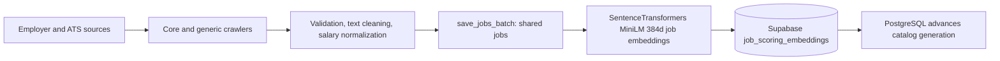

# Scraper Architecture & Ingestion Pipeline

`services/scraper/` is a vacancy data provider. It does not read profiles, evaluate candidates, or write `user_job_evaluations`.

## Data Flow

```mermaid
flowchart LR
    Sources[Employer and ATS sources] --> Crawlers[Core and generic crawlers]
    Crawlers --> Clean[Validation, text cleaning, salary normalization]
    Clean --> Jobs[save_jobs_batch: shared jobs]
    Jobs --> Embeddings[SentenceTransformers MiniLM 384d job embeddings]
    Embeddings --> DB[(Supabase job_scoring_embeddings)]
    DB --> Trigger[PostgreSQL advances catalog generation]
```

`pipeline/runner.py` coordinates the crawlers and catalog maintenance. Every adapter writes through `database/repository.py:save_jobs_batch`, which validates, cleans, deduplicates, and saves shared vacancy facts. Once each batch is persisted, `database/embeddings.py:prepare_embeddings` computes missing or changed `all-MiniLM-L6-v2` job vectors. The model runs locally with Apple Metal when available and CPU otherwise. It never loads a profile model or candidate data.

The statement trigger on `job_scoring_embeddings` advances one catalog generation. Candidate scoring is decoupled from ingestion and driven by the durable worker. User profile vectors are generated in a browser worker; profile/vector writes enqueue work atomically. `rescore_user` requests a retry or shortlist limit change and does not score synchronously. A completed request keeps at most 1,500 native evaluations. Catalog refreshes score only changed or missing facts. Score composition for weight changes happens in `get_jobs_page` and overview metrics from stored sub-scores.

The scraper hashes scoring job facts separately from the embedding document. A salary or location change updates the job vector row even if the encoded text is unchanged, which invokes the SQL trigger to refresh affected evaluations.

## CLI and API

- `make scrape` crawls all configured employers and saves jobs and embeddings.
- `make scrape-backfill` prepares missing vectors for an existing catalog without crawling.
- `make scrape-test NAME="Employer Name"` limits the crawl to one employer.
- `make scrape-core` runs core sources only.
- `make scrape-validate` checks source configuration.
- The local API exposes catalog and sync endpoints. It does not expose profiles or candidate evaluations.

## Safety

The scraper service role key stays in the local process. Candidate records remain behind Supabase RLS. Deduplication transfers user statuses and evaluations through the service-only database RPC before deleting a duplicate. Age, an empty crawl or source failure never authorizes vacancy deletion. The retired `--prune-only` command is rejected; the old SQL pruning RPC is retained only as a no-op for deployed callers. The scraper never returns candidate data in API responses.

Full sync responses retain `prune_stats: {}` for compatibility with existing consumers;
there is no pruning phase. New retirement behavior requires source-specific closure
evidence, preservation of candidate tracking and regression tests. See
[Regression Prevention](REGRESSION_PREVENTION.md).

Run `make scrape-lint` and `make scrape-unit` after changes to this service.
