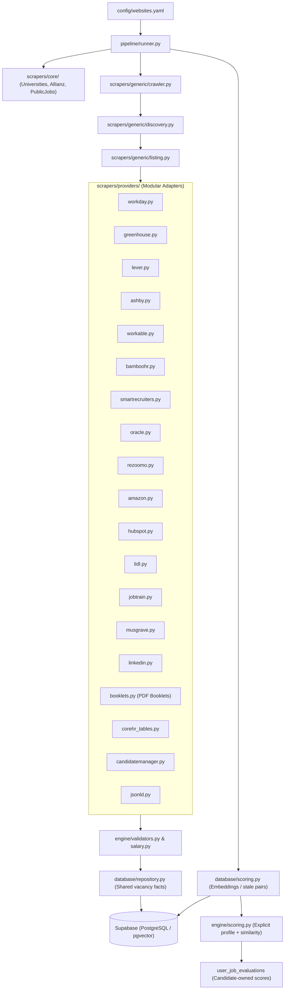

# Scraper Architecture & Ingestion Pipeline

`services/scraper/` discovers Irish employer openings, extracts job details, scores candidate fit, and writes to Supabase. The browser never loads the scraper's service role key.

## Data Flow

```mermaid
flowchart TD
    Config["config/websites.yaml"] --> Runner["pipeline/runner.py"]
    Runner --> Specialized["scrapers/core/ (Universities, Allianz, PublicJobs)"]
    Runner --> Generic["scrapers/generic/crawler.py"]
    Generic --> Discovery["scrapers/generic/discovery.py"]
    Discovery --> Dispatcher["scrapers/generic/listing.py"]

    subgraph Providers ["scrapers/providers/ (Modular Adapters)"]
        Workday["workday.py"]
        Greenhouse["greenhouse.py"]
        Lever["lever.py"]
        Ashby["ashby.py"]
        Workable["workable.py"]
        BambooHR["bamboohr.py"]
        SmartRecruiters["smartrecruiters.py"]
        Oracle["oracle.py"]
        Rezoomo["rezoomo.py"]
        Amazon["amazon.py"]
        HubSpot["hubspot.py"]
        Lidl["lidl.py"]
        JobTrain["jobtrain.py"]
        Musgrave["musgrave.py"]
        LinkedIn["linkedin.py"]
        Booklets["booklets.py (PDF Booklets)"]
        CoreHR["corehr_tables.py"]
        CandidateManager["candidatemanager.py"]
        JsonLD["jsonld.py"]
    end

    Dispatcher --> Providers
    Providers --> Validation["engine/validators.py & salary.py"]
    Validation --> Repository["database/repository.py (Shared vacancy facts)"]
    Repository --> Supabase[("Supabase (PostgreSQL / pgvector)")]
    Runner --> Cache["database/scoring.py (Embeddings / stale pairs)"]
    Cache --> Supabase
    Cache --> Scoring["engine/scoring.py (Explicit profile + similarity)"]
    Scoring --> Evaluations["user_job_evaluations (Candidate-owned scores)"]
```

## Modular Components

1. **Configuration (`config/`)**:
   - `websites.yaml`: Employer watchlist, career URLs, sectors, and priority weights.
   - `loader.py`: Config parsing and tenant profile loading via immutable `user_id`.
   - `rules.py`: Default scoring criteria and negative domain penalties.

2. **Ingestion & Crawling (`scrapers/`)**:
   - `scrapers/core/`: Specialized scrapers for complex multi-step portals (PublicJobs, Allianz, DCU, Trinity, UCD, Maynooth, Housing Agency, IDA, Intel, Kerry).
   - `scrapers/generic/crawler.py`: Concurrent crawler with domain-level rate limiting (`BoundedSemaphore`).
   - `scrapers/generic/discovery.py`: Resolves career page redirects, SPA links, and auth walls.
   - `scrapers/generic/listing.py`: High-level dispatcher coordinating structured ATS providers and falling back to HTML link heuristics.
   - `scrapers/providers/`: Single-responsibility, stateless adapters for 20+ ATS systems (Workday CXS, Greenhouse, Lever, Ashby, Workable, BambooHR, SmartRecruiters, Oracle Cloud HCM, Personio, Teamtailor, Rezoomo, Amazon Jobs, HubSpot GraphQL, JobTrain, Lidl Ireland, Musgrave, LinkedIn cards, Candidate Information Booklet PDFs, CoreHR tables, and Schema.org JSON-LD).
   - `tools/harvest_boards.py`: Concurrent ATS board harvester and scanner (`make scrape-harvest`) to discover active Ireland vacancies across candidate employer boards and auto-promote verified sources into `websites.yaml`.

3. **Evaluation Engine (`engine/`)**:
   - `text_cleaner.py`: Description cleaning and HTML-to-Markdown normalization (`clean_job_description`), cookie banner and ATS boilerplate disclaimer stripping (EEOC, GDPR, security footers), section header markdown formatting (`### Header`), bullet point standardization (`- Item`), and location normalization. Raw descriptions are cleaned directly during ETL ingestion before database upsert, ensuring clean markdown across all downstream consumers.
   - `validators.py`: Filtering of non-job anchor links, generic documents, and invalid titles.
   - `salary.py`: Heuristic extraction and normalization of annual/daily Euro salary ranges.
   - `scoring.py`: Batch embedding generation and deterministic candidate rule evaluation using dense semantic embeddings (`all-MiniLM-L6-v2` accelerated via Apple Silicon Metal MPS or CPU fallback), combined with title and seniority matching.

4. **Database Repository & Maintenance Safety (`database/`)**:
   - `client.py`: Thread-safe singleton Supabase client (`_client_lock`) using service-role credentials.
   - `repository.py`:
     - Multi-tenant evaluation upserts keyed strictly by `(user_id, job_id)`.
     - All adapters batch shared vacancy facts through one validation, cleaning, and persistence path. Core adapters request short-description enrichment; the generic crawler supplies its own extracted details. After ingestion and catalog maintenance, the pipeline refreshes stale candidate evaluations once. Scoring failures propagate without repeating successful vacancy writes.
     - **Safe Deduplication**: Normalizes employer, title, and URL into `dedupe_key`. Transfers both `user_job_statuses` and `user_job_evaluations` by `user_id` before removing duplicate rows; fails closed if transfer errors or status conflicts occur.
     - **Safe Pruning**: Lifecycle cleanup of untracked postings older than retention window. Verifies `user_job_statuses` and halts immediately (`RuntimeError`) if status query fails, preventing accidental deletion of user-tracked jobs.

5. **Server & CLI (`server/`, `app.py`)**:
   - `app.py`: CLI commands (`--validate-config`, `--employer`, `--user-id`, `--server`). Binds to loopback `127.0.0.1` by default.
   - `server/api.py`: Lightweight HTTP daemon for sync triggers and catalog inspection. Limits request payloads (`MAX_REQUEST_BYTES = 64KB`), validates shapes, and enforces bearer token authorization on remote reads (`GET /api/profile`).

## Fit Scoring & Match Calculation Engine

The candidate match percentage (`relevance: 0–100%`) is calculated dynamically per opportunity and tenant profile in `services/scraper/engine/scoring.py`. It combines 12 multi-dimensional signals weighted according to the candidate's preferences:

1. **Semantic AI Similarity (Default max: 25 pts)**:
   - Uses `SentenceTransformer("all-MiniLM-L6-v2")` running on Apple Silicon Metal MPS (with CPU or token-frequency cosine fallback).
   - Embeds candidate headline, current role, career summary, skills, qualifications, and certifications against the opportunity title and cleaned description text. Target roles remain a separate title-matching signal.
2. **Domain Alignment (Default max: 25 pts)**:
   - Evaluates positive domain patterns (`positive_domains` configured in profile). Full match yields 1.0 (title) or 0.8 (description).
   - Negative domain terms (`negative_domains`) heavily penalize the score, capping overall match at 15%.
3. **Seniority Alignment (Default max: 15 pts)**:
   - Evaluates title seniority tiers: Executive / Director / Lead / Senior / Mid-Level / Junior.
   - Applies tier weight multipliers from candidate's profile rules.
4. **Competencies, Tools & Certifications (Default max: 20 pts)**:
   - Scans job text for candidate-specified keywords, tools/software, and professional certifications.
   - Matches are tracked in `matched_skills` and boost competency score proportionally.
5. **Salary & Compensation Benchmark (Default max: 15 pts)**:
   - Compares advertised compensation against candidate's canonical `salary_min` (annual EUR target).
   - Uses the same normalized salary amounts, currency, and period as catalog filters. Meeting the annual EUR target yields 1.0; unadvertised or non-comparable pay uses a neutral 0.75 baseline. Other currencies and pay periods are not imputed into annual EUR pay.
6. **Contract & Employment Type (Default max: 10 pts)**:
   - Honors `employment`: permanent-only preferences reduce fixed-term scores to 0.55 and apply the fixed-term penalty; permanent-and-fixed-term preferences accept both; contract preferences favor fixed-term roles; open-to-all preferences apply no contract penalty. Dealbreakers remain independent.
7. **Target Role Match (Bonus: +6 pts)**:
   - Direct substring match between candidate's `target_roles` and job title.
8. **Location Preference (Bonus: up to +4 pts)**:
   - Priority-weighted based on position in `target_locations` (1st preference gets 100% bonus, 2nd gets 80%, etc., down to 40% floor).
9. **Work Mode Alignment (Bonus / Penalty)**:
   - Matches remote/hybrid/on-site preferences against job text (+2 pts match bonus; -4 pts if strictly on-site when remote/hybrid is preferred).
10. **Work Authorization & Visa Support**:
    - Right-to-work (EU / Stamp 4) satisfies requirements; roles explicitly rejecting visa sponsorship incur deductions for candidates requiring sponsorship.
11. **Disqualifiers & Dealbreakers**:
   - Disqualification patterns (e.g. required Irish language fluency when not spoken) cap final relevance at the profile dealbreaker threshold (default: 10%).
12. **Fit Tiers**:
    - `Strong Match`: $\ge 75\%$
    - `Good Match`: $55\% \le \text{score} < 75\%$
    - `Moderate Match`: $35\% \le \text{score} < 55\%$
    - `Low Match`: $15\% \le \text{score} < 35\%$
    - `Mismatch`: $< 15\%$

The repository writes `{ relevance, fit_tier, matched_skills, ai_analysis: { reasoning, alignments, mismatches, sub_scores } }` to `user_job_evaluations`.

Shared jobs contain vacancy facts only. Ingestion writes vacancy facts only. The CLI and sync API then use one
full-catalog scoring phase: persisted vectors and stale-pair lookup, followed by
`evaluate_job` with an explicit profile and precomputed similarity. Profiles compile matching patterns and prepare fingerprints once per run;
the rule evaluator performs no database lookup or model inference. The shared catalogue
scorer, implicit default-profile scorer, and `evaluate_match` wrapper are removed.
PublicJobs ingests valid vacancies without a selected candidate's title-score
filter; validation and personalized evaluation happen in the repository.

The scraper API `/api/jobs` and `/api/jobs/:id` return shared vacancy facts.
Lists sort by recency. Candidate domain filtering and score ranking belong to
`get_jobs_page`; the catalogue API rejects candidate domain filters. The administrative
profile endpoint requires an explicit `user_id` and reads that profile fresh; it
never selects the first available candidate or substitutes defaults on read failure.

### Exact, incremental pgvector scoring

`shared/scoringDefaults.json` supplies the defaults for Python and the browser.
Rule JSON uses `keywords` and `disqualifiers`; a forward migration merges historical
`patterns` terms and removes `irish_language_patterns` without losing rule metadata.
Missing lists use defaults, while explicitly empty lists remain empty. No default
dealbreakers are hidden in the editor. The fallback is token-frequency cosine,
not TF-IDF: it does not calculate inverse document frequency.

`database/scoring.py` manages persisted 384-dimensional MiniLM embeddings in
`job_scoring_embeddings` and `profile_scoring_embeddings`. Only the scraper's
service role can access these tables or the `get_job_scoring_work` RPC. Candidate
vectors are deleted when their profile is deleted; job vectors follow job deletion.

The initial run embeds missing documents in batches. Subsequent runs compare
document hashes and model versions before loading the model. Embeddings use the
same profile document and 2,500-character job-text truncation as the previous
semantic scorer. A bounded process cache reuses identical documents across embedding batches.

The RPC computes exact cosine similarity for stale user-job pairs in bounded
pages, then Python applies the existing personalized rules and weights. There
is no approximate shortlist or HNSW dependency. Every job remains eligible for
every user's ranking, preserving whole-catalog metrics and score filtering.

Evaluation fingerprints include job scoring inputs, profile scoring inputs,
rules/weights, and algorithm/model versions. Changes to salary, location, rules,
or weights invalidate evaluations; changes to contact information, avatars, or
`last_seen_at` do not. Changing only weights does not re-embed documents, but it
currently reruns the rule evaluator on the affected pairs. Unchanged evaluations
are neither recomputed nor rewritten, including the default post-scrape rescore.

When inference is unavailable, missing vectors use the existing token-frequency
fallback. These evaluations have a separate version and are reevaluated when
dense vectors become available. Fallback values are never stored as dense vectors.

Apply the forward migration before running the updated scraper. The first run
will backfill embeddings and evaluations automatically; there is no database
reset or separate backfill command required for an existing deployment. The CLI
checks RPC availability before scoring or crawling. Run `make scrape-rescore`
to backfill an existing catalog without crawling employers. Scraper connection
selection remains configured through the existing environment variables.

Scoring version `exact-pgvector-v2` refreshes cached evaluations after the salary,
contract-preference, and rule-normalization corrections. Apply pending migrations
with the frontend release, then run `make scrape-rescore`. Embedding content and
model versions remain unchanged, so unchanged documents reuse persisted vectors.

This removes repeated inference and repeated work on unchanged pairs. `--no-rescore` skips the scoring phase entirely. An initial
full backfill still performs users × jobs rule evaluations and writes those
evaluations. Its cost is not eliminated by pgvector.

## Concurrency & Thread Safety

- **Client Singleton**: Database connection pool and PostgREST client initialization are guarded by `threading.Lock()`.
- **Model Inference**: SentenceTransformer model loading and tensor operations across concurrent crawler workers are synchronized via `threading.RLock()`.
- **Embedding Cache**: Persisted documents use SHA-256 content hashes and model versions. The in-process document cache is bounded to 4,096 entries and protected by the model lock.

## Boundaries & Verification

- Configure sources in [`websites.yaml`](../services/scraper/config/websites.yaml), not scraper code.
- Never expose the service role key to frontend code.
- All Python linting and formatting runs via `uv run --locked` using the project virtualenv.
- Verify scraper code before changes with `make scrape-lint` and `make scrape-unit`.
