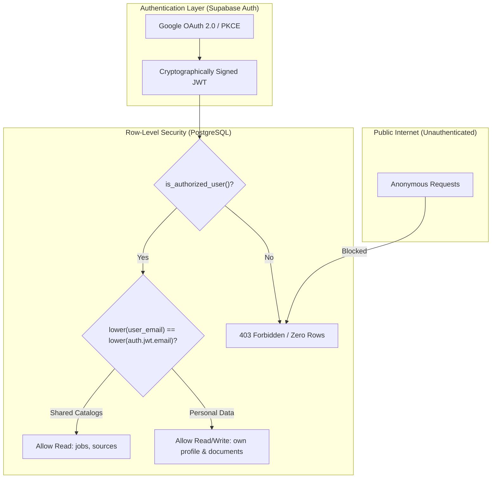

# Security & Multi-Tenancy Architecture

JobPulse handles sensitive candidate career documents (resumes, cover letters, compensation targets, contact info).
This document details the multi-tenant defense-in-depth model implemented across the frontend and database layers.

## Multi-Tenant Security Boundaries

## Security Guardrails

### 1. Zero Trust for Anonymous Clients (`anon`)

- The anonymous Supabase role (`anon`) has zero select, insert, update, or delete permissions across all tables.
- All stored procedure RPCs (`get_overview_metrics`, `get_jobs_page`) have execute privileges revoked from `anon`.

### 2. Whitelist-Based Access Control (`authorized_users`)

- After successful Google OAuth sign-in, the user's email is evaluated against `public.authorized_users` via the
  `public.is_authorized_user()` function.
- The `is_authorized_user()` function runs with `SECURITY DEFINER` and `SET search_path = public` to avoid search
  path hijacking and circular RLS recursion.
- Non-whitelisted authenticated users receive an access-denied state and cannot query any job data.

### 3. Strict Tenant Row Isolation

Every candidate-specific table implements strict isolation policies:

- `user_profiles`: `lower(user_email) = lower(auth.jwt() ->> 'email')`
- `user_job_statuses`: `lower(user_email) = lower(auth.jwt() ->> 'email')`
- `user_job_evaluations`: `lower(user_email) = lower(auth.jwt() ->> 'email')`
- `user_cvs`: `lower(user_email) = lower(auth.jwt() ->> 'email')`
- `user_cover_letters`: `lower(user_email) = lower(auth.jwt() ->> 'email')`

Even if an authenticated attacker modifies the frontend query to target another user's email, PostgreSQL silently
filters the query to return zero rows.

### 4. Supabase Storage Object Isolation (`user-documents`)

Resumes and cover letters are stored in the private `user-documents` Supabase Storage bucket.

- **Path Convention**: Document objects must follow the naming pattern:
  `{user_email}/cv/{timestamp}_{filename}` or `{user_email}/cover-letter/{timestamp}_{filename}`.
- **Storage RLS Policies**: Storage operations enforce that the first path segment matches the caller's JWT email:
  `lower(split_part(name, '/', 1)) = lower(auth.jwt() ->> 'email')`.
- Candidates cannot download, inspect, or overwrite documents belonging to another candidate.

### 5. Quota Enforcement & Abuse Protection

- **Document Size Cap**: 10MB maximum file size enforced at the bucket level and validated on the frontend.
- **MIME Type Allowlist**: Restricted to `application/pdf`, `application/msword`, `docx`, and `text/plain`.
- **Count Quotas**: PostgreSQL database triggers (`trg_check_user_cv_limit` and `trg_check_user_cover_letter_limit`)
  strictly enforce a maximum limit of 10 CVs and 10 Cover Letters per user.

### 6. PII Sanitization Guidelines

- No personal phone numbers, private email addresses, home addresses, or credentials should ever be hardcoded
  into codebase files or documentation.
- Test seeds and documentation examples must strictly use RFC 2606 reserved domains (e.g. `@example.com`).
- The repository pre-commit hook runs `gitleaks protect --staged` to catch any accidental credential leaks.

### 7. Browser Security Headers

`public/_headers` is deployed by Cloudflare Pages and applies defense-in-depth browser controls:

- A Content Security Policy limits executable code to same-origin assets, disallows plugins and framing, and permits
  only HTTPS/WebSocket API connections required by Supabase.
- `X-Content-Type-Options: nosniff`, frame denial, a strict referrer policy, and a restrictive permissions policy
  reduce exposure to MIME confusion, clickjacking, referrer leakage, and unused browser capabilities.
- Links opened in a new tab use `noopener,noreferrer` so an external destination cannot control the opener page.
